# Academic Project Presentation

## Smart Predictive Maintenance System Using Vibration Data

**Format:** 12-slide technical academic project review  
**Duration:** 10-15 minutes  
**Audience:** University project guide, review panel, evaluators, and student peers  
**Primary message:** The system reduces unplanned machine downtime by converting vibration patterns into early, actionable maintenance alerts.

---

## Slide 1: Smart Predictive Maintenance Using Vibration Data

**Key message:** A low-cost IoT and ML prototype can detect machine health degradation before failure.

**Bullet content:**

- Smart Predictive Maintenance System
- Uses vibration data to monitor machine condition
- Detects healthy, degrading, or faulty behavior
- Team members: `<Name 1>`, `<Name 2>`, `<Name 3>`
- Guide/Professor: `<Guide Name>`

**Speaker notes:**

Introduce the project as a condition-monitoring system for machines such as motors, pumps, fans, and bearings. Explain that the aim is not just to collect sensor data, but to convert vibration behavior into useful maintenance decisions before a serious breakdown occurs.

**Suggested diagram or visual:**

Hero visual showing a machine connected to a vibration sensor, processing system, dashboard, and alert.

**Mermaid code:**

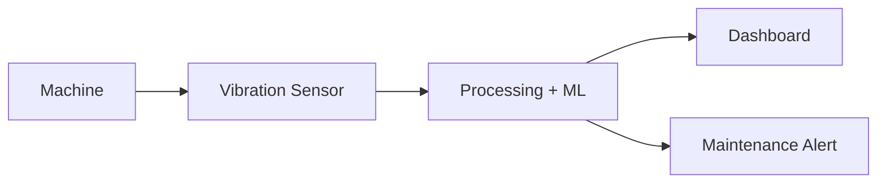

---

## Slide 2: Problem Statement

**Key message:** Traditional maintenance often detects faults too late or wastes resources through fixed schedules.

**Bullet content:**

- Machines show early fault signs through vibration changes
- Manual and scheduled maintenance may miss early degradation
- Sudden breakdowns cause downtime, cost, and safety risk
- Goal: detect abnormal vibration early and support planned maintenance

**Speaker notes:**

Explain that machines usually do not fail instantly. Before failure, vibration patterns often change due to imbalance, wear, misalignment, looseness, or bearing problems. The challenge is that traditional methods do not continuously observe these subtle changes.

**Suggested diagram or visual:**

Problem funnel from small vibration change to major failure, showing where early detection helps.

**Mermaid code:**

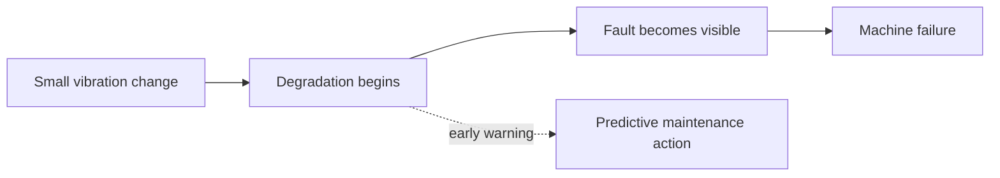

---

## Slide 3: Existing Methods / Current Approaches

**Key message:** Current approaches are useful, but they are either late, fixed, manual, threshold-limited, or costly.

**Bullet content:**

- Reactive maintenance repairs after failure
- Scheduled maintenance services at fixed intervals
- Manual inspection depends on technician experience
- Threshold monitoring detects only large abnormal changes
- Industrial systems can be costly for small-scale use

**Speaker notes:**

Walk through the current maintenance methods and their limitations. Position the proposed system as a middle path: more intelligent than simple manual or threshold systems, but suitable for an academic prototype using accessible hardware and software.

**Suggested diagram or visual:**

Comparison diagram of existing approaches and their limitations.

**Mermaid code:**

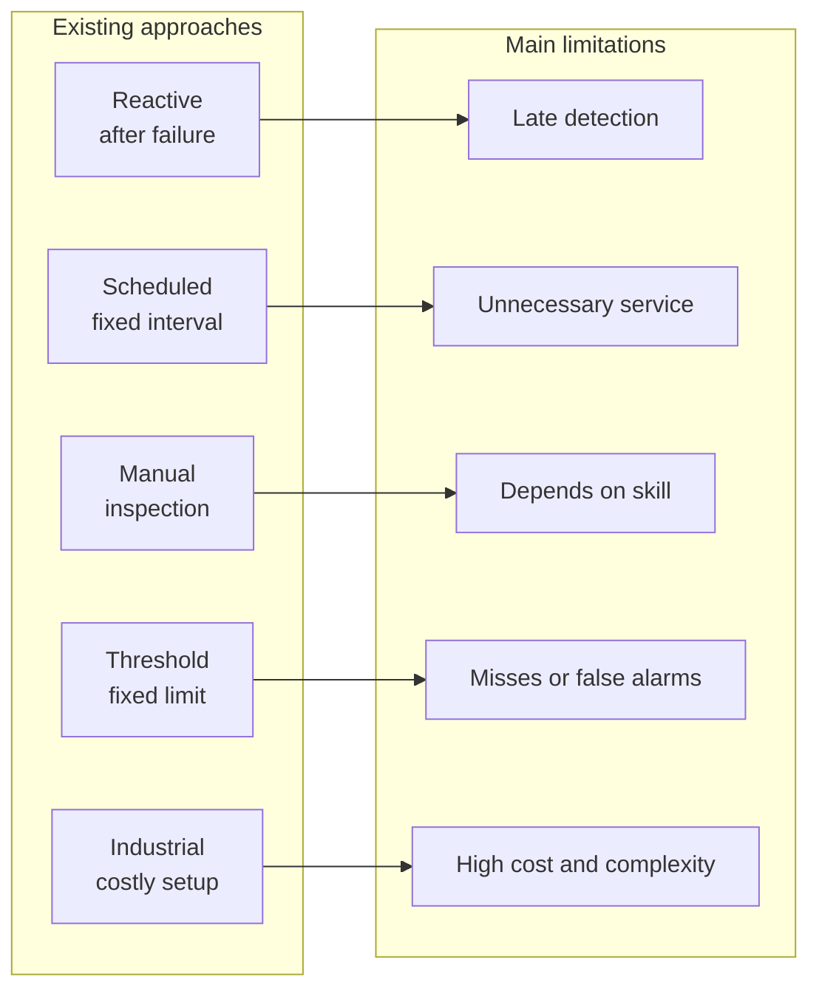

---

## Slide 4: Proposed System

**Key message:** The proposed system converts vibration readings into health status, severity, and maintenance alerts.

**Bullet content:**

- Captures vibration data from sensor or dataset
- Processes and extracts useful signal features
- Classifies machine state as healthy, degrading, or faulty
- Generates alerts with severity and recommendation
- Displays current status and historical trends

**Speaker notes:**

Describe the solution at a high level. The system observes vibration, cleans the data, extracts features such as RMS and peak value, uses a model or rule logic to classify health, and then communicates the result through dashboard and alerts.

**Suggested diagram or visual:**

High-level architecture from machine layer to application layer.

**Mermaid code:**

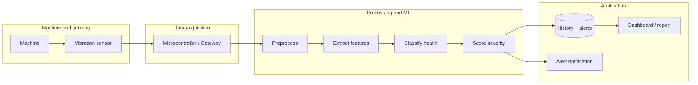

---

## Slide 5: System Architecture

**Key message:** The architecture is modular, so each function can be tested and improved independently.

**Bullet content:**

- Sensor module collects raw vibration readings
- Communication module sends timestamped data
- Processing module cleans and windows the signal
- ML module predicts machine condition
- Storage and dashboard modules preserve evidence and show results

**Speaker notes:**

Emphasize the modular design decision. Separating modules reduces development risk and makes future improvements easier. For example, the classifier can be upgraded without rewriting the dashboard, and the sensor input can be replaced by a dataset during demonstration.

**Suggested diagram or visual:**

Component-level architecture with module interactions.

**Mermaid code:**

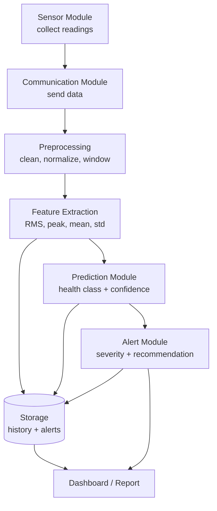

---

## Slide 6: Data Flow and Module Interactions

**Key message:** Raw vibration data becomes usable maintenance evidence through a staged processing pipeline.

**Bullet content:**

- Input: acceleration readings, timestamp, machine ID, sensor ID
- Processing: validation, normalization, windowing, feature extraction
- Output: health class, confidence, severity, alert, trend
- Stored history supports review and future model improvement

**Speaker notes:**

Explain the transformation of data. The important outcome is that the system does not only store raw values; it converts them into features, predictions, alerts, and trends that are useful for maintenance decisions.

**Suggested diagram or visual:**

Data flow diagram from raw readings to dashboard and alert history.

**Mermaid code:**

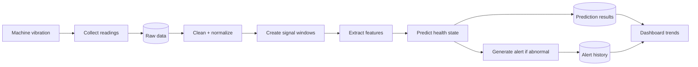

---

## Slide 7: User Workflow

**Key message:** The user workflow is simple: monitor, receive alert, inspect, and plan maintenance.

**Bullet content:**

- Operator views machine health status
- System detects abnormal vibration automatically
- Alert includes severity and possible issue
- Supervisor reviews trend and schedules maintenance
- Human decision remains part of the process

**Speaker notes:**

Show that the system supports maintenance users rather than replacing them. The operator receives understandable status and alerts, while the supervisor uses trend evidence to decide priority and timing.

**Suggested diagram or visual:**

User journey diagram showing setup, monitoring, alert response, and review.

**Mermaid code:**

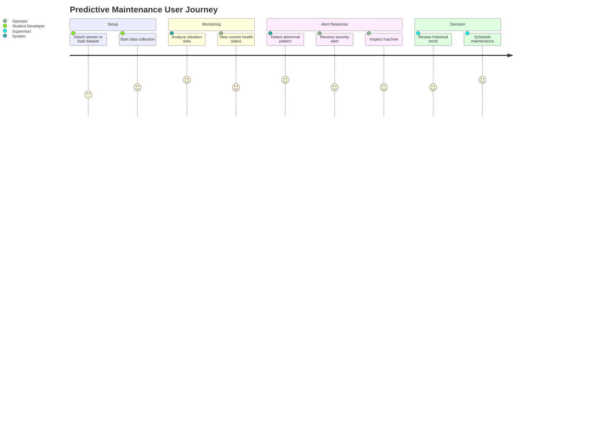

---

## Slide 8: Sequence Diagram - Typical End-to-End Workflow

**Key message:** The complete workflow connects sensor readings, ML prediction, alerting, and dashboard update.

**Bullet content:**

- Sensor captures vibration signal
- Gateway sends timestamped readings
- Pipeline extracts features and predicts health
- Abnormal condition triggers alert
- Dashboard updates current status and history

**Speaker notes:**

Use this slide to explain the typical runtime behavior step by step. Focus on the value of the loop: every reading can become a status update, a trend point, or an early warning alert.

**Suggested diagram or visual:**

End-to-end sequence diagram for monitoring and alert generation.

**Mermaid code:**

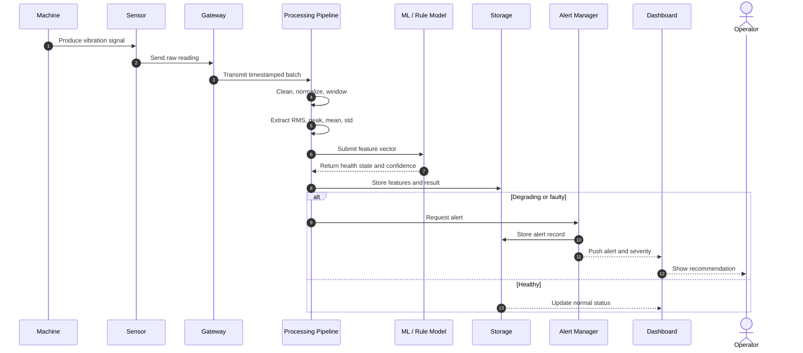

---

## Slide 9: Implementation Details

**Key message:** The prototype uses practical, accessible technologies while preserving a path to future scaling.

**Bullet content:**

- Hardware: vibration sensor or accelerometer, Arduino/ESP32/Raspberry Pi
- Communication: Serial, Wi-Fi, MQTT, HTTP, or Bluetooth
- Processing: Python-based signal cleaning and feature extraction
- Storage: CSV, SQLite, local files, or cloud database
- Dashboard: web dashboard, desktop UI, or structured report
- Model: ML classifier or rule-based baseline for health state detection

**Speaker notes:**

Keep the implementation discussion concise. Mention that the exact technology can vary depending on available hardware. The important design choice is the modular pipeline, which allows the same logic to work with live sensor input or a stored dataset.

**Suggested diagram or visual:**

Technology stack diagram grouped by hardware, communication, processing, storage, and UI.

**Mermaid code:**

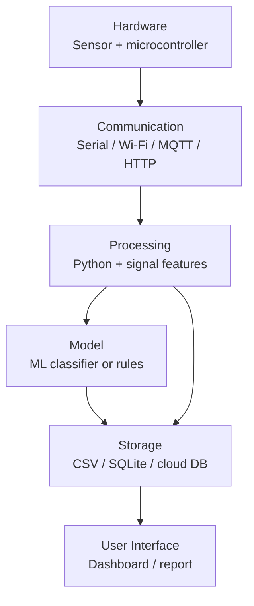

---

## Slide 10: Advantages of the Proposed System

**Key message:** The proposed system improves maintenance decisions by adding early detection, evidence, and scalability.

**Bullet content:**

- Detects abnormal vibration before major failure
- Reduces unplanned downtime and emergency repair risk
- Supports condition-based maintenance instead of fixed schedules
- Provides historical trend evidence
- Can extend to more sensors, machines, and fault classes

**Speaker notes:**

Compare against existing methods. The main benefit is not only automation; it is better timing. Maintenance can happen when the machine condition indicates risk, not only after failure or at fixed intervals.

**Suggested diagram or visual:**

Outcome comparison between current methods and proposed system.

**Mermaid code:**

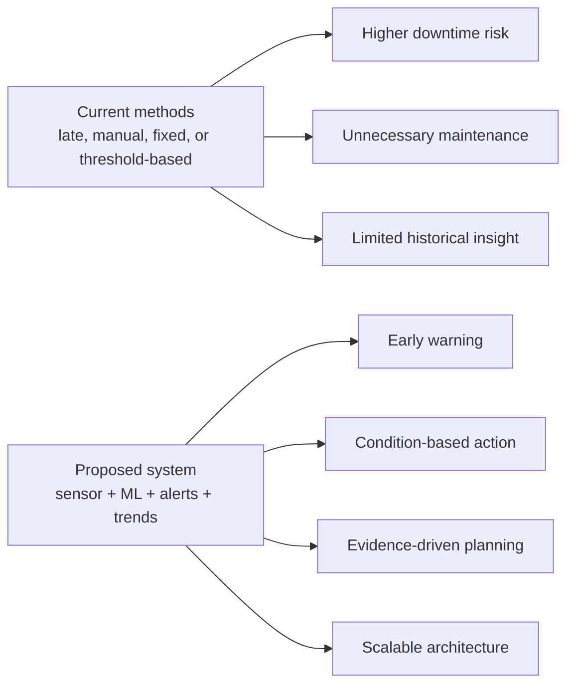

---

## Slide 11: Challenges, Limitations, and Future Enhancements

**Key message:** The prototype is valuable today, and its limitations define a clear research and development roadmap.

**Bullet content:**

- Challenges: noisy sensor data, sensor placement, limited labeled fault data
- Limitations: academic prototype, not full industrial deployment
- Accuracy depends on data quality and model validation
- Future: fault classification, severity improvement, mobile alerts
- Future: multi-machine monitoring, cloud IoT, remaining useful life estimation

**Speaker notes:**

Be realistic and credible. Acknowledge that predictive maintenance quality depends on good data and testing. Then show that the architecture already supports future growth, including better models, multiple machines, and richer alert channels.

**Suggested diagram or visual:**

Roadmap from current prototype to advanced predictive maintenance platform.

**Mermaid code:**

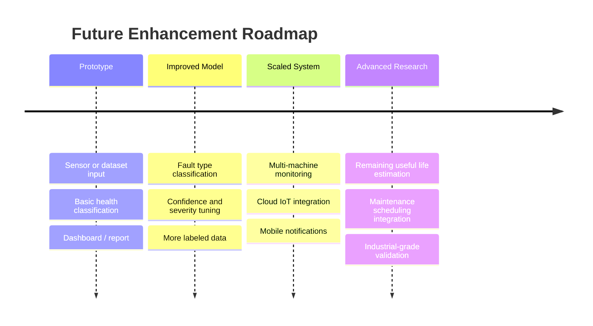

---

## Slide 12: Conclusion

**Key message:** The project demonstrates a complete predictive maintenance loop from vibration sensing to maintenance decision support.

**Bullet content:**

- Built around a real industrial problem: unexpected machine failure
- Uses vibration data as an early warning signal
- Combines IoT, signal processing, ML, dashboard, and alerts
- Supports better maintenance timing and reduced downtime
- Provides a foundation for future industrial and research extensions

**Speaker notes:**

Close by summarizing the contribution. The project shows how sensor data can be converted into machine health insight and actionable alerts. Reinforce that the system assists human maintenance decisions and provides a scalable base for future improvements.

**Suggested diagram or visual:**

Final contribution map connecting technical components to outcomes.

**Mermaid code:**

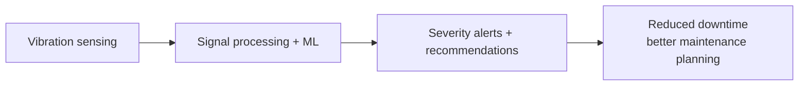

---

## 10-15 Minute Delivery Plan

| Slide | Time |
| --- | --- |
| 1 | 45 sec |
| 2 | 1 min |
| 3 | 1 min |
| 4 | 1.5 min |
| 5 | 1.5 min |
| 6 | 1 min |
| 7 | 1 min |
| 8 | 1.5 min |
| 9 | 1 min |
| 10 | 1 min |
| 11 | 1 min |
| 12 | 45 sec |

