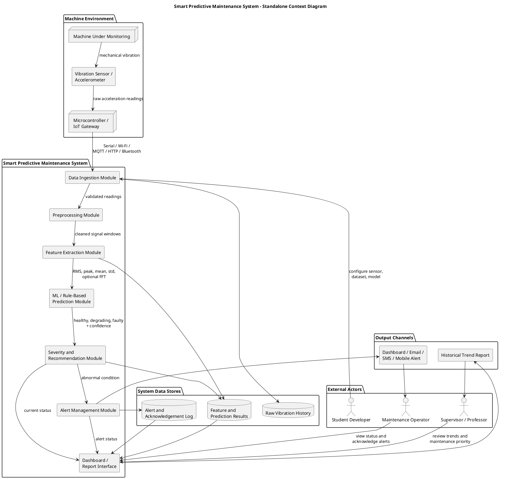

# Standalone System Context Diagram

## Smart Predictive Maintenance System Using Vibration Data

This standalone diagram shows the complete system in one view: external actors, monitored machine environment, internal system components, data stores, and output channels.

## Mermaid

```mermaid
flowchart LR
    subgraph actors["External Actors"]
        operator["Maintenance Operator"]
        supervisor["Supervisor / Professor"]
        developer["Student Developer"]
    end

    subgraph field["Machine Environment"]
        machine["Machine Under Monitoring"]
        sensor["Vibration Sensor / Accelerometer"]
        gateway["Microcontroller / IoT Gateway"]
        machine -->|"mechanical vibration"| sensor
        sensor -->|"raw acceleration readings"| gateway
    end

    subgraph system["Smart Predictive Maintenance System"]
        ingestion["Data Ingestion Module"]
        preprocessing["Preprocessing Module"]
        features["Feature Extraction Module"]
        prediction["ML / Rule-Based Prediction Module"]
        severity["Severity and Recommendation Module"]
        alerting["Alert Management Module"]
        dashboard["Dashboard / Report Interface"]

        ingestion -->|"validated readings"| preprocessing
        preprocessing -->|"cleaned signal windows"| features
        features -->|"RMS, peak, mean, std, optional FFT"| prediction
        prediction -->|"healthy, degrading, faulty + confidence"| severity
        severity -->|"abnormal condition"| alerting
        severity -->|"current status"| dashboard
        alerting -->|"alert status"| dashboard
    end

    subgraph stores["System Data Stores"]
        rawStore[("Raw Vibration History")]
        featureStore[("Feature and Prediction Results")]
        alertStore[("Alert and Acknowledgement Log")]
    end

    subgraph channels["Output Channels"]
        notification["Dashboard / Email / SMS / Mobile Alert"]
        report["Historical Trend Report"]
    end

    gateway -->|"Serial / Wi-Fi / MQTT / HTTP / Bluetooth"| ingestion
    developer -->|"configure sensor, dataset, model"| ingestion
    ingestion --> rawStore
    features --> featureStore
    severity --> featureStore
    alerting --> alertStore
    featureStore --> dashboard
    alertStore --> dashboard
    dashboard --> report
    alerting --> notification

    operator -->|"view status and acknowledge alerts"| dashboard
    supervisor -->|"review trends and maintenance priority"| dashboard
    notification --> operator
    report --> supervisor
```

## PlantUML

## How To Use This Diagram

- Use it as a single architecture overview slide.
- Place it after the problem statement and before detailed data flow or sequence diagrams.
- Explain it from left to right: actors and machine environment feed the system, the system analyzes vibration, data stores preserve evidence, and output channels help users act.

