# Technical Presentation Material

## Smart Predictive Maintenance System Using Vibration Data

### Repository Analysis Summary

This repository is a documentation-first project for an academic prototype. It does not contain application source code yet; the architecture is derived from the current project documents:

- `PROJECT_CONTEXT.md`: defines the core idea, basic project flow, value, and advanced feature direction.
- `SRS_Document.md`: defines functional requirements, non-functional requirements, interfaces, data requirements, use cases, architecture layers, and risks.
- `Existing_vs_Proposed_System.md`: compares reactive, scheduled, manual, threshold-based, and advanced industrial systems against the proposed IoT and ML-based approach.
- `SRS_Document.docx` and `Existing_vs_Proposed_System.docx`: Word companions to the Markdown source documents.

The proposed system is a smart predictive maintenance prototype for machines such as motors, pumps, fans, and bearings. It captures vibration signals through a sensor or dataset, sends readings to a local or cloud processing system, preprocesses the signal, extracts time-domain and optional frequency-domain features, classifies machine health, stores results, and raises alerts with severity and recommendations.

### Architectural Assumptions

- The current scope is an academic proof of concept, not a full industrial deployment.
- Data can come from either physical vibration hardware or a stored/simulated dataset.
- Processing can run locally on a laptop or on a cloud/server environment.
- Communication protocols may include Serial, Wi-Fi, MQTT, HTTP, Bluetooth, or similar options depending on the prototype hardware.
- Storage may be CSV, SQLite, another lightweight database, or cloud storage.
- The dashboard may be a web dashboard, desktop UI, or structured report.
- Security controls apply most strongly when cloud communication, multiple users, or remote dashboards are enabled.

### Critical Workflow Ranking

The top 3 critical workflows selected for sequence diagrams are:

1. **Continuous monitoring and health classification**: This is the core system loop and covers collection, preprocessing, feature extraction, prediction, and dashboard update.
2. **Abnormal vibration alert lifecycle**: This turns model output into operational action and addresses severity, duplicate suppression, notification, acknowledgement, and recommendation.
3. **Historical trend review**: This supports supervisor decision-making, validates the value of stored data, and helps show gradual degradation over time.

---

## 1. High-Level System Architecture Diagram

### Reasoning

This diagram shows the system as a layered IoT and ML architecture. It mirrors the SRS architecture layers: machine, sensor, data acquisition, processing, ML, storage, and application. It also includes the dataset path because the SRS explicitly allows simulated or stored vibration data for academic demonstration. The alert service is separated from the ML model because the model predicts condition, while alerting translates prediction into user-facing action.

### Mermaid

```mermaid
flowchart LR
    subgraph Field["Machine and sensing layer"]
        Machine["Physical machine<br/>(motor, pump, fan, bearing)"]
        Sensor["Vibration sensor / accelerometer"]
        Machine -->|"mechanical vibration"| Sensor
    end

    subgraph Edge["Data acquisition layer"]
        Gateway["Microcontroller / gateway<br/>(Arduino, ESP32, Raspberry Pi)"]
        Buffer["Local buffer<br/>(temporary failure handling)"]
        Sensor -->|"raw vibration readings"| Gateway
        Gateway --> Buffer
    end

    subgraph Transport["Communication layer"]
        Protocol["Serial / Wi-Fi / MQTT / HTTP / Bluetooth"]
        Gateway -->|"timestamped readings"| Protocol
    end

    subgraph Processing["Processing and intelligence layer"]
        Ingestion["Data ingestion service"]
        Preprocess["Preprocessing<br/>(clean, normalize, window)"]
        Features["Feature extraction<br/>(mean, std, peak, RMS, optional FFT)"]
        Model["ML or rule model<br/>(healthy, degrading, faulty)"]
        Severity["Severity and recommendation logic"]
        Ingestion --> Preprocess --> Features --> Model --> Severity
    end

    Dataset["Stored / simulated vibration dataset"] --> Ingestion
    Protocol --> Ingestion

    subgraph Storage["Storage layer"]
        RawStore[("Raw and processed vibration history")]
        ResultStore[("Prediction results and health status")]
        AlertStore[("Alert log and acknowledgement history")]
    end

    Ingestion --> RawStore
    Features --> ResultStore
    Severity --> ResultStore

    subgraph Application["Application layer"]
        Dashboard["Dashboard / report UI"]
        AlertService["Alert service<br/>(dashboard, email, SMS, mobile optional)"]
    end

    Severity -->|"abnormal condition"| AlertService
    AlertService --> AlertStore
    ResultStore --> Dashboard
    AlertStore --> Dashboard

    Operator["Maintenance operator"]
    Supervisor["Supervisor / evaluator"]
    Dashboard --> Operator
    Dashboard --> Supervisor
    AlertService --> Operator
```

### PlantUML

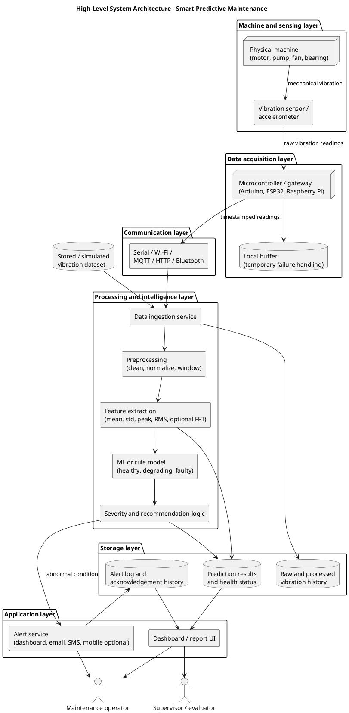

---

## 2. Component-Level Architecture Diagram

### Reasoning

This diagram expands the modules listed in the SRS into implementable components. The boundary between edge acquisition, signal processing, application services, and storage makes the system modular, satisfying the maintainability requirement that collection, preprocessing, model analysis, alerting, and dashboard functions should be separated. The model artifact is shown as a deployable asset so future versions can improve the classifier without changing the rest of the pipeline.

### Mermaid

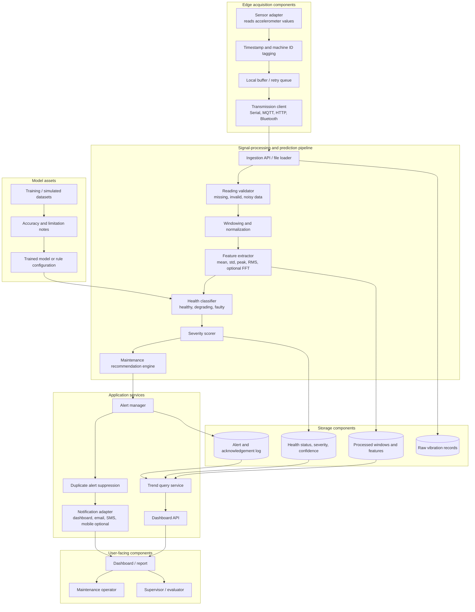

### PlantUML

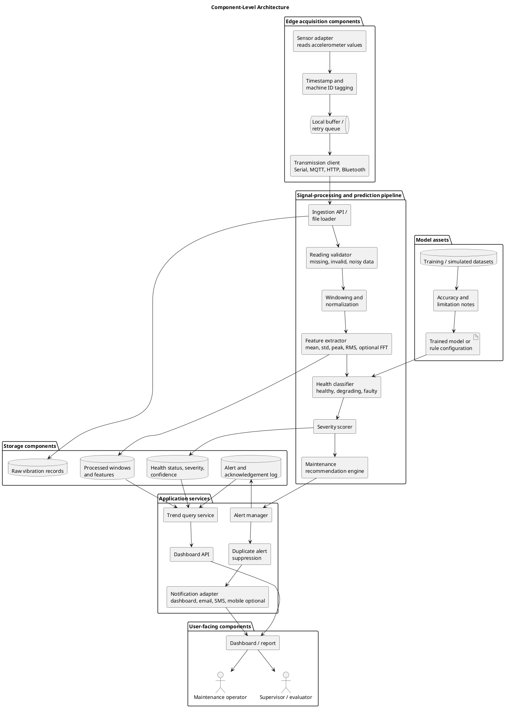

---

## 3. User Journey Diagram

### Reasoning

This diagram frames the system from the perspective of operators, supervisors, and student developers. It connects setup, monitoring, alert response, and review. The user journey is important for the presentation because the project is not only a model pipeline; its value comes from turning vibration changes into a maintenance decision before a breakdown.

### Mermaid

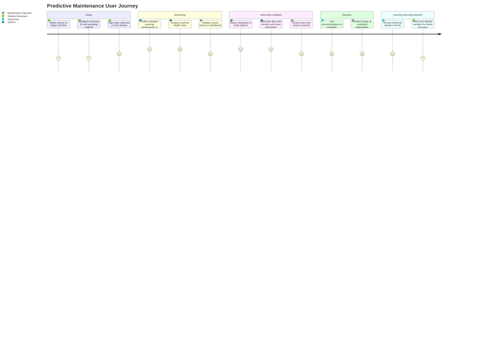

### PlantUML

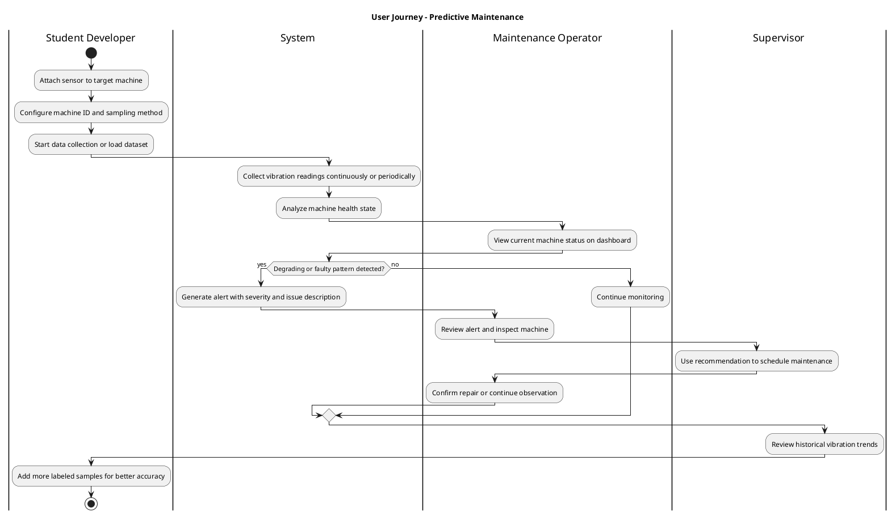

---

## 4. Sequence Diagram 1 - Continuous Monitoring and Health Classification

### Reasoning

This is the core runtime loop. It maps directly to the functional requirements for data collection, transmission, preprocessing, feature extraction, classification, storage, and dashboard display. The sequence includes the communication failure fallback because reliability is a stated requirement and the SRS expects temporary failures to be handled by notification or local storage where possible.

### Mermaid

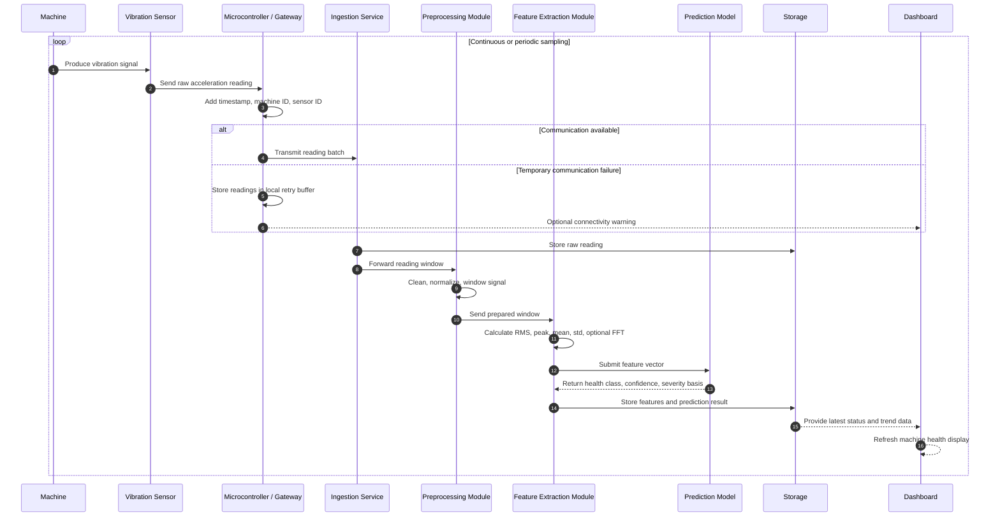

### PlantUML

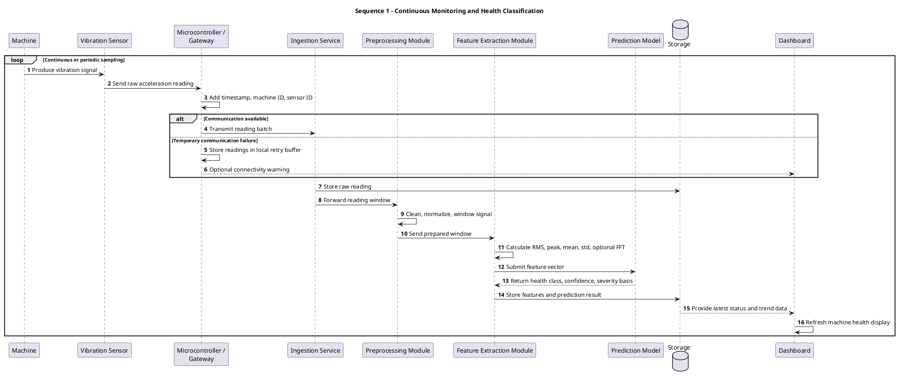

---

## 5. Sequence Diagram 2 - Abnormal Vibration Alert Lifecycle

### Reasoning

This workflow starts after classification identifies a degrading or faulty condition. It shows how a technical prediction becomes a human action. Duplicate suppression is included because repeated alerts are a risk in the SRS. The alert includes health status, time, severity, issue description, and recommendation, matching the alert requirements.

### Mermaid

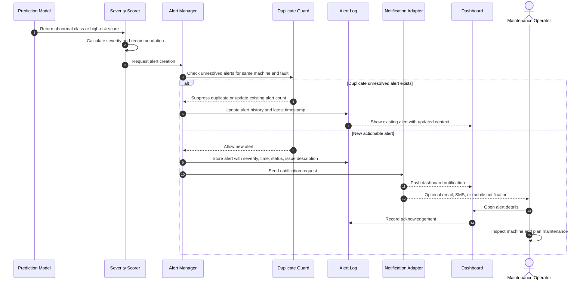

### PlantUML

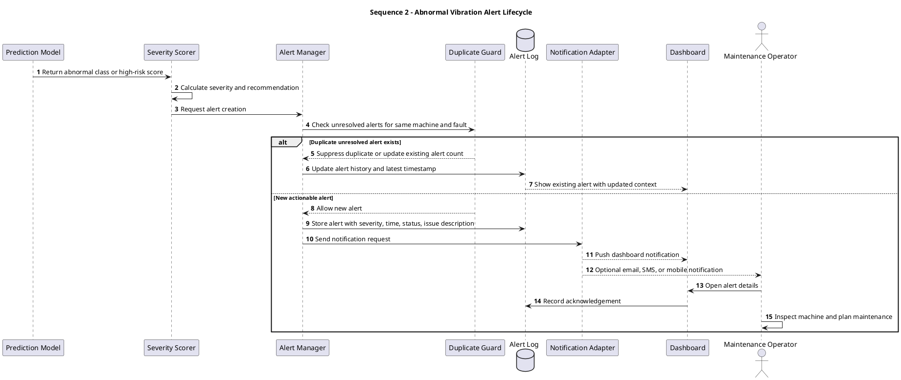

---

## 6. Sequence Diagram 3 - Historical Trend Review

### Reasoning

Historical review is the bridge between raw monitoring and maintenance planning. It shows the supervisor asking for trends, the system retrieving vibration windows, predictions, and alert logs, and the dashboard presenting evidence. This workflow supports the SRS requirements for historical vibration trends, alert history, and retrieval of past machine health data.

### Mermaid

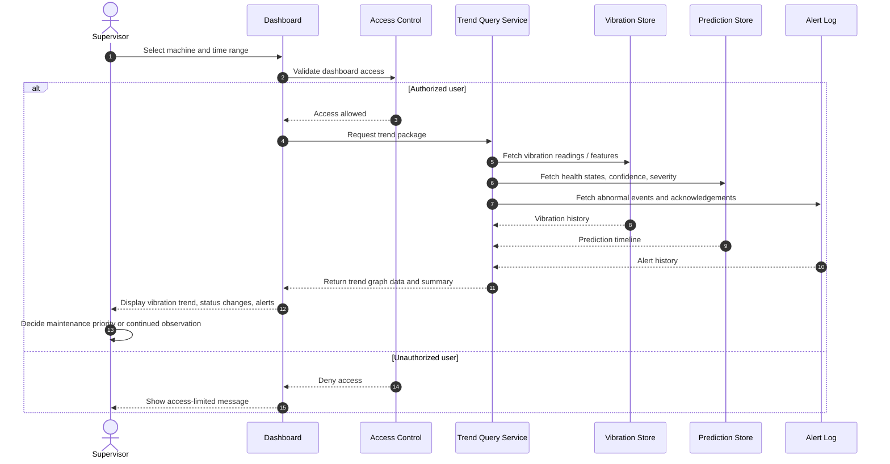

### PlantUML

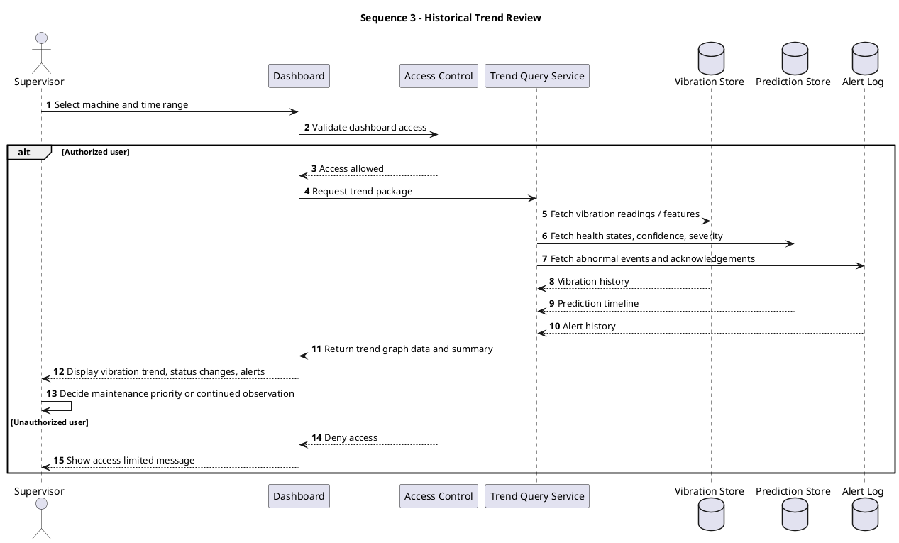

---

## 7. Current Industry Approach vs Our Approach Comparison Diagram

### Reasoning

The comparison document identifies five existing approaches: reactive, scheduled, manual inspection, threshold-based monitoring, and advanced industrial systems. This diagram contrasts those methods with the proposed system's predictive, continuous, data-driven approach. It is designed for a business-value slide because it makes the shift clear: from late or fixed-time maintenance to early warning based on actual machine condition.

### Mermaid

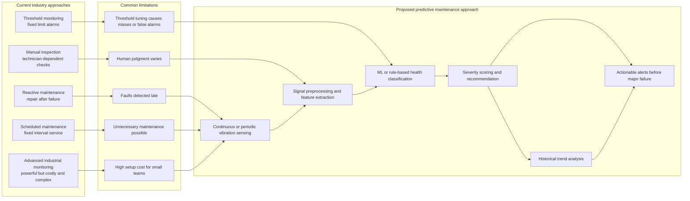

### PlantUML

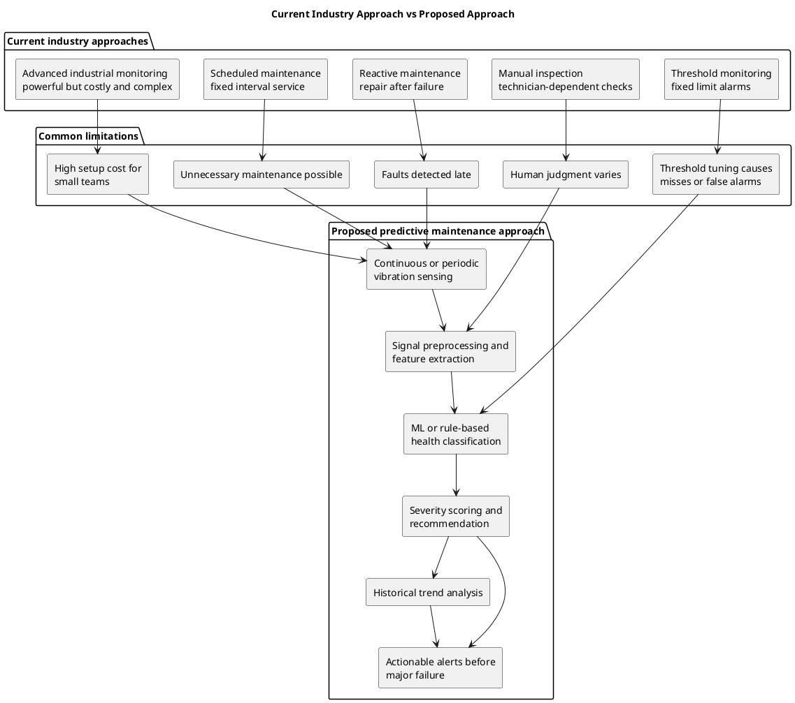

---

## 8. Data Flow Diagram

### Reasoning

This is a level-1 data flow view. It focuses on what data enters, how it transforms, and which stores retain it. It highlights the core data products: raw readings, cleaned windows, features, prediction results, alerts, and trend summaries. This diagram is useful for explaining the technical pipeline without showing deployment infrastructure.

### Mermaid

```mermaid
flowchart LR
    ExternalMachine["External entity:<br/>Machine under monitoring"]
    User["External entity:<br/>Operator / Supervisor"]

    P1["P1 Collect vibration data"]
    P2["P2 Transmit or load data"]
    P3["P3 Preprocess signal"]
    P4["P4 Extract features"]
    P5["P5 Predict machine health"]
    P6["P6 Generate alert and recommendation"]
    P7["P7 Present dashboard and reports"]

    D1[("D1 Raw vibration readings")]
    D2[("D2 Processed windows")]
    D3[("D3 Feature vectors")]
    D4[("D4 Prediction results")]
    D5[("D5 Alert history")]

    ExternalMachine -->|"acceleration signal"| P1
    P1 -->|"timestamp, machine ID, sensor ID, sampling rate"| D1
    P1 -->|"reading batch"| P2
    P2 -->|"valid received data"| P3
    D1 -->|"stored readings for replay"| P3
    P3 -->|"cleaned and normalized windows"| D2
    P3 -->|"prepared signal windows"| P4
    P4 -->|"mean, std, peak, RMS, optional FFT"| D3
    P4 -->|"feature vector"| P5
    P5 -->|"health class, confidence, severity basis"| D4
    P5 -->|"abnormal result"| P6
    P6 -->|"alert, severity, issue, recommendation"| D5
    D2 --> P7
    D3 --> P7
    D4 --> P7
    D5 --> P7
    P7 -->|"status, trends, alerts, recommendation"| User
    User -->|"acknowledgement, machine/time filters"| P7
    P7 -->|"acknowledgement update"| D5
```

### PlantUML

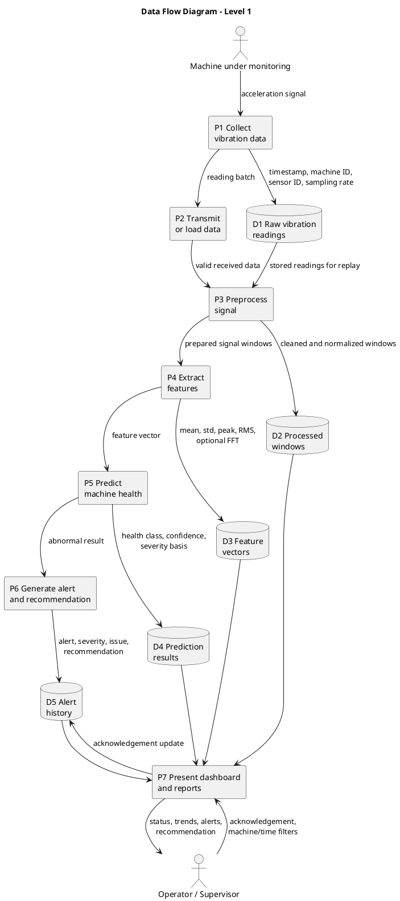

---

## 9. Deployment Architecture Diagram

### Reasoning

The SRS allows three operating modes: local prototype, cloud-connected setup, and simulated dataset demonstration. This diagram shows all three without implying that the academic prototype must use full industrial infrastructure. It separates edge hardware, processing runtime, storage, user devices, and optional external notification channels.

### Mermaid

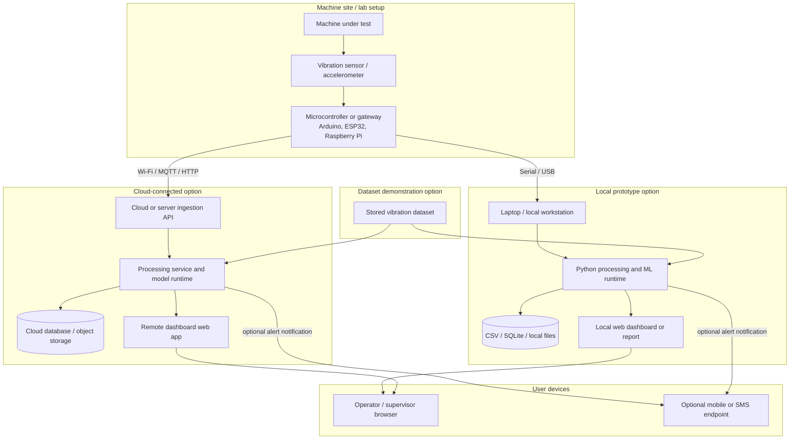

### PlantUML

```plantuml
@startuml
title Deployment Architecture
skinparam shadowing false

node "Machine site / lab setup" as Site {
  node "Machine under test" as Machine
  device "Vibration sensor /\naccelerometer" as Sensor
  node "Microcontroller or gateway\nArduino, ESP32, Raspberry Pi" as Gateway
  Machine --> Sensor
  Sensor --> Gateway
}

node "Local prototype option" as Local {
  node "Laptop / local workstation" as Laptop
  component "Python processing and\nML runtime" as LocalRuntime
  database "CSV / SQLite /\nlocal files" as LocalDB
  component "Local web dashboard\nor report" as LocalDashboard
  Laptop --> LocalRuntime
  LocalRuntime --> LocalDB
  LocalRuntime --> LocalDashboard
}

cloud "Cloud-connected option" as Cloud {
  component "Cloud or server\ningestion API" as API
  component "Processing service and\nmodel runtime" as CloudRuntime
  database "Cloud database /\nobject storage" as CloudDB
  component "Remote dashboard\nweb app" as WebApp
  API --> CloudRuntime
  CloudRuntime --> CloudDB
  CloudRuntime --> WebApp
}

node "Dataset demonstration option" as Simulation {
  database "Stored vibration dataset" as Dataset
}

node "User devices" as Users {
  node "Operator / supervisor browser" as Browser
  node "Optional mobile or\nSMS endpoint" as Mobile
}

Gateway --> Laptop : Serial / USB
Gateway --> API : Wi-Fi / MQTT / HTTP
Dataset --> LocalRuntime
Dataset --> CloudRuntime
LocalDashboard --> Browser
WebApp --> Browser
CloudRuntime --> Mobile : optional alert notification
LocalRuntime --> Mobile : optional alert notification
@enduml
```

---

## 10. Security Architecture Diagram

### Reasoning

The SRS security requirements are intentionally lightweight because the project is an academic prototype, but they still identify secure communication, dashboard access limits, and avoiding unnecessary exposure of sensitive machine or user data. This diagram turns those requirements into practical security boundaries: physical device access, secure transport, authenticated APIs, role-based dashboard access, protected storage, and auditability.

### Mermaid

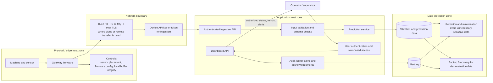

### PlantUML

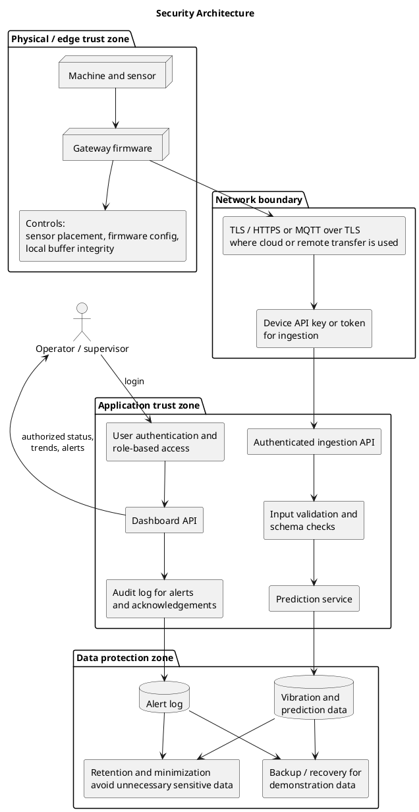

---

## 11. Presentation Slide Outline

### Narrative Thesis

The proposed system moves maintenance from reactive or fixed-schedule decisions to condition-based, data-driven decisions by converting vibration patterns into machine health status, severity, alerts, and trend evidence.

### Recommended Deck Structure

| Slide | Claim Title | Proof Object | Business Value | Technical Advantage |
| --- | --- | --- | --- | --- |
| 1 | Vibration data can reveal machine failure before breakdown. | Opening system concept visual: machine, sensor, dashboard, alert. | Positions the project around downtime reduction and early warning. | Anchors the technical story in condition monitoring and signal patterns. |
| 2 | Current maintenance methods either react too late or service too early. | Current industry approach vs proposed approach diagram. | Explains cost, downtime, and resource waste from reactive and scheduled maintenance. | Shows why simple thresholds and manual inspection are insufficient for early-stage faults. |
| 3 | Our approach turns machine vibration into an actionable maintenance decision. | High-level system architecture diagram. | Makes the value chain clear from machine signal to maintenance action. | Shows layered IoT, processing, ML, storage, dashboard, and alerting responsibilities. |
| 4 | The core pipeline is modular, testable, and upgradeable. | Component-level architecture diagram. | Reduces project risk and supports future improvements by module. | Separates acquisition, preprocessing, feature extraction, prediction, alerting, storage, and UI. |
| 5 | The data flow preserves both real-time status and historical evidence. | Data flow diagram. | Enables status monitoring, trend analysis, and maintenance planning. | Shows how raw readings become windows, features, predictions, alerts, and dashboard summaries. |
| 6 | Continuous monitoring provides the earliest warning signal. | Sequence diagram 1: monitoring and health classification. | Reduces unplanned downtime by detecting degradation before failure. | Explains sampling, timestamping, preprocessing, feature extraction, classification, and storage. |
| 7 | Alerts convert prediction into operator action. | Sequence diagram 2: abnormal vibration alert lifecycle. | Prevents alarm fatigue and helps teams act on severity. | Includes severity scoring, recommendation, duplicate suppression, notification, and acknowledgement. |
| 8 | Historical trends help supervisors prioritize maintenance. | Sequence diagram 3: historical trend review. | Moves maintenance decisions from guesswork to evidence. | Combines vibration history, prediction timeline, and alert logs under access control. |
| 9 | The user journey is simple enough for operators, supervisors, and evaluators. | User journey diagram. | Makes the system understandable to non-ML users. | Shows setup, monitoring, alert review, maintenance decision, and future learning loop. |
| 10 | The prototype can run locally, in the cloud, or from a dataset. | Deployment architecture diagram. | Fits academic constraints while leaving room for future scaling. | Supports physical hardware, simulated datasets, local runtime, and cloud-connected deployment. |
| 11 | Security is scoped to the prototype but aligned with real deployment needs. | Security architecture diagram. | Builds evaluator confidence that machine and alert data are not exposed unnecessarily. | Adds secure transport, authenticated ingestion, role-based dashboard access, validation, audit, retention, and backup. |
| 12 | The proposed system improves reliability without replacing human judgement. | Benefits and limitations table. | Shows realistic value: downtime reduction, better scheduling, lower emergency repair risk. | Clarifies model dependency on sensor quality, labeled data, and human verification. |
| 13 | Future enhancements can extend the same architecture. | Roadmap visual: fault classification, RUL, multi-machine monitoring, cloud IoT, mobile alerts, ERP integration. | Demonstrates growth path beyond the prototype. | Shows that the modular design can add sensors, models, fault classes, and integrations. |
| 14 | The final demonstration proves the complete loop from sensor data to maintenance decision. | Demo script timeline. | Gives evaluators a clear success path. | Verifies collection/loading, preprocessing, classification, alerting, dashboard/reporting, and historical review. |

### Speaker Flow

1. Start with the business problem: failures are expensive because current methods often react late or service on fixed schedules.
2. Introduce vibration as the measurable early-warning signal.
3. Show the high-level architecture to make the end-to-end system understandable.
4. Drill down into the component and data flow diagrams to prove technical feasibility.
5. Use the three sequence diagrams to explain exactly how the system behaves during monitoring, alerting, and supervisor review.
6. Close with deployment flexibility, security controls, limitations, and roadmap.

### Key Business Value Points

- Reduces unplanned downtime by detecting abnormal vibration before major failure.
- Reduces unnecessary maintenance by acting on actual machine condition rather than only fixed schedules.
- Helps operators and supervisors make evidence-based maintenance decisions.
- Makes predictive maintenance accessible as an academic prototype using low-cost hardware or datasets.
- Creates a foundation for future multi-machine, cloud, mobile, and industrial integration.

### Key Technical Advantage Points

- Modular pipeline: acquisition, transmission, preprocessing, feature extraction, prediction, alerting, dashboard, and storage are separated.
- Flexible input sources: real sensor readings or simulated/stored vibration datasets.
- Signal-processing foundation: cleaned windows and features such as RMS, peak, mean, standard deviation, and optional FFT.
- Intelligence layer: health classification into healthy, degrading, and faulty states, with optional fault type, confidence, and severity.
- Operational layer: alert generation, duplicate suppression, recommendations, and acknowledgement history.
- Scalability path: future support for multiple machines, new sensors, new fault classes, cloud IoT platforms, and remaining useful life estimation.
- Security-aware design: authenticated transfer, limited dashboard access, validation, audit logs, retention, and backup controls where needed.

### Suggested Visual Order for the Deck

1. Current industry approach vs our approach
2. High-level architecture
3. Component-level architecture
4. Data flow
5. Sequence diagrams for monitoring, alerting, and trend review
6. User journey
7. Deployment architecture
8. Security architecture
9. Roadmap and final demo loop

### Demo Storyline

1. Start the sensor or load a stored vibration dataset.
2. Show raw or recent vibration readings entering the system.
3. Show preprocessing and feature extraction output.
4. Show the classifier result: healthy, degrading, or faulty.
5. Trigger an abnormal case and show severity plus recommendation.
6. Open the dashboard or report to review the current status.
7. Review historical vibration trend and alert log.
8. Explain how the operator uses the alert to inspect or schedule maintenance.
