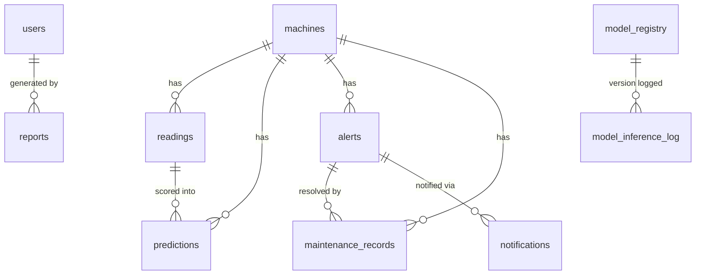
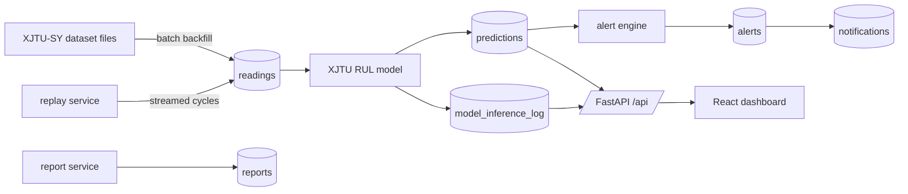

# MaintainIQ Data Model

The living reference for MaintainIQ's data model, ingestion, storage, model
telemetry, and report catalog. Canonical dataset: **XJTU-SY** run-to-failure
bearings. Design of record:
[`docs/superpowers/specs/2026-08-06-xjtu-sy-ml-integration-design.md`](superpowers/specs/2026-08-06-xjtu-sy-ml-integration-design.md).

> Temperature is **not** part of this model. It exists only in the quarantined
> legacy IMS pipeline under `src/legacy/` (synthetic, preserved for possible
> future NASA-IMS validation) and never in the canonical schema or API.

## Entity-relationship diagram



Notes on the diagram versus a naive reading of the schema: `predictions`
references both `machines` and `readings`, but `reading_id` is nullable, so
not every prediction is tied to a stored reading row (the live/demo path can
score without persisting a reading first). `model_inference_log` carries a
`model_version` string but has no `FOREIGN KEY` to `model_registry` in
`src/storage/db.py` — the relationship is logical (join key), not enforced.
`reports.generated_by` likewise stores a `users.id` value without a declared
foreign key.

## Tables

### `schema_version`

Migration bookkeeping for the versioned runner in `src/storage/migrations.py`.

| Column | Type | Notes |
| --- | --- | --- |
| `version` | INTEGER NOT NULL | Migration step number that has been applied. |
| `applied_at` | TEXT NOT NULL | Defaults to `datetime('now')`. |

### `machines`

One row per bearing/machine, carrying XJTU-SY metadata.

| Column | Type | Notes |
| --- | --- | --- |
| `machine_id` | TEXT PRIMARY KEY | Stable machine identifier. |
| `bearing_id` | TEXT | XJTU-SY bearing identifier (e.g. `Bearing1_1`). |
| `operating_condition` | INTEGER | XJTU-SY operating condition, one of `1 \| 2 \| 3`. |
| `speed_rpm` | REAL | Nominal shaft speed for the condition. |
| `load_kn` | REAL | Nominal radial load for the condition. |
| `dataset` | TEXT NOT NULL DEFAULT `'xjtu_sy'` | Multi-dataset isolation seam. |
| `is_documented_failure` | INTEGER NOT NULL DEFAULT 0 | 1 if this bearing has a documented run-to-failure end point. |
| `created_at` | TEXT NOT NULL | Defaults to `datetime('now')`. |

### `readings`

Per-cycle windowed feature rows. There is no separate raw-waveform table: the
XJTU-SY ingestion/backfill path produces pre-windowed feature rows directly,
so this table represents both a "raw reading" and its "feature window" at
once (documented limitation in `src/storage/db.py`).

| Column | Type | Notes |
| --- | --- | --- |
| `id` | INTEGER PRIMARY KEY AUTOINCREMENT | |
| `machine_id` | TEXT NOT NULL REFERENCES `machines(machine_id)` | |
| `timestamp` | TEXT NOT NULL | ISO-8601 timestamp of the window. |
| `cycle` | INTEGER NOT NULL | Sequential cycle number for the machine. |
| `elapsed_minutes` | REAL NOT NULL | Minutes elapsed since run start. |
| `speed_rpm` | REAL NOT NULL | |
| `load_kn` | REAL NOT NULL | |
| `sample_rate_hz` | REAL NOT NULL | |
| `vibration_h_rms` | REAL NOT NULL | Horizontal-axis RMS, promoted from `features_json` for queryability. |
| `vibration_h_kurtosis` | REAL NOT NULL | Horizontal-axis kurtosis. |
| `vibration_v_rms` | REAL NOT NULL | Vertical-axis RMS. |
| `vibration_v_kurtosis` | REAL NOT NULL | Vertical-axis kurtosis. |
| `cross_axis_rms_ratio` | REAL NOT NULL | h/v RMS ratio. |
| `cross_axis_correlation` | REAL NOT NULL | h/v correlation. |
| `rul_minutes` | REAL | NULL for live rows without a known ground-truth label. |
| `features_json` | TEXT NOT NULL | Full per-window feature vector (superset of the promoted columns above); new features need no schema change. |
| `dataset` | TEXT NOT NULL DEFAULT `'xjtu_sy'` | |

Constraint: `UNIQUE(machine_id, cycle)` — inserts are idempotent per
machine/cycle (`insert_readings` uses `INSERT OR IGNORE`).
Index: `idx_readings_machine_ts (machine_id, timestamp)`.

### `predictions`

Model output per scored reading.

| Column | Type | Notes |
| --- | --- | --- |
| `id` | INTEGER PRIMARY KEY AUTOINCREMENT | |
| `machine_id` | TEXT NOT NULL REFERENCES `machines(machine_id)` | |
| `reading_id` | INTEGER REFERENCES `readings(id)` | Nullable — not every scored prediction has a persisted reading. |
| `timestamp` | TEXT NOT NULL | |
| `health_state` | TEXT NOT NULL | |
| `confidence` | REAL | |
| `source` | TEXT NOT NULL DEFAULT `'xjtu_rul'` | Which model/pipeline produced the row. |
| `model_name` | TEXT | |
| `probable_cause` | TEXT | |
| `created_at` | TEXT NOT NULL | Defaults to `datetime('now')`. |
| `predicted_rul_minutes` | REAL | |
| `rul_estimate_kind` | TEXT | `point_estimate \| lower_bound`. |
| `failure_within_horizon_probability` | REAL | |
| `prognostic_horizon_minutes` | REAL | |
| `prediction_interval_low` | REAL | |
| `prediction_interval_high` | REAL | 90% interval bounds (low/high) around the point estimate. |
| `model_version` | TEXT | |
| `out_of_distribution` | INTEGER NOT NULL DEFAULT 0 | Boolean flag stored as 0/1. |
| `history_snapshots` | INTEGER | |
| `warnings_json` | TEXT | |

Index: `idx_predictions_machine_ts (machine_id, timestamp)`.

### `model_inference_log`

One row per inference call, for observability (heartbeat + telemetry read
from this table).

| Column | Type | Notes |
| --- | --- | --- |
| `id` | INTEGER PRIMARY KEY AUTOINCREMENT | |
| `machine_id` | TEXT NOT NULL | Not a declared foreign key. |
| `timestamp` | TEXT NOT NULL | |
| `model_version` | TEXT NOT NULL | Logical join key to `model_registry.model_version` (not enforced). |
| `latency_ms` | REAL NOT NULL | |
| `failure_probability` | REAL | |
| `predicted_rul_minutes` | REAL | |
| `out_of_distribution` | INTEGER NOT NULL DEFAULT 0 | |
| `warming_up` | INTEGER NOT NULL DEFAULT 0 | |
| `warnings_count` | INTEGER NOT NULL DEFAULT 0 | |
| `status` | TEXT NOT NULL DEFAULT `'ok'` | `ok \| error`. |
| `error_message` | TEXT | |
| `created_at` | TEXT NOT NULL | Defaults to `datetime('now')`. |

Indexes: `idx_inference_model_ts (model_version, timestamp)`,
`idx_inference_machine_ts (machine_id, timestamp)`.

### `model_registry`

Deployable model versions.

| Column | Type | Notes |
| --- | --- | --- |
| `model_version` | TEXT PRIMARY KEY | |
| `artifact_path` | TEXT NOT NULL | Path to the serialized model artifact. |
| `algorithm` | TEXT | |
| `trained_at` | TEXT | |
| `metrics_json` | TEXT | Serialized evaluation metrics. |
| `deployed_at` | TEXT | |
| `is_active` | INTEGER NOT NULL DEFAULT 0 | Exactly one row is expected to be active at a time. |

### `reports`

Generated report artifacts (see [Report catalog](#report-catalog)).

| Column | Type | Notes |
| --- | --- | --- |
| `id` | INTEGER PRIMARY KEY AUTOINCREMENT | |
| `report_type` | TEXT NOT NULL | `machine_prognostic \| model_performance \| fleet_summary`. |
| `scope` | TEXT NOT NULL | Machine ID for `machine_prognostic`; `"fleet"` for the other two types. |
| `format` | TEXT NOT NULL | `markdown \| json`. |
| `period_start` | TEXT | Nullable filter bound. |
| `period_end` | TEXT | Nullable filter bound. |
| `generated_at` | TEXT NOT NULL | Defaults to `datetime('now')`. |
| `generated_by` | INTEGER | `users.id`; not a declared foreign key. |
| `content` | TEXT NOT NULL | Rendered report body in `format`. |
| `summary_json` | TEXT | Machine-readable summary the `content` was rendered from — the two are always in sync because both derive from one summary dict. |

### `alerts`

Open/resolved machine alerts.

| Column | Type | Notes |
| --- | --- | --- |
| `id` | INTEGER PRIMARY KEY AUTOINCREMENT | |
| `machine_id` | TEXT NOT NULL | Not a declared foreign key. |
| `opened_at` | TEXT NOT NULL | |
| `resolved_at` | TEXT | |
| `severity` | TEXT NOT NULL | |
| `health_state` | TEXT NOT NULL | |
| `probable_cause` | TEXT | |
| `message` | TEXT | |
| `status` | TEXT NOT NULL DEFAULT `'open'` | |
| `source` | TEXT | |
| `created_at` | TEXT NOT NULL | |
| `acknowledged_at` | TEXT | |
| `acknowledged_by` | INTEGER | |

Index: `idx_alerts_machine_status (machine_id, status)`.

### `maintenance_records`

Preventive/corrective maintenance history linked to alerts.

| Column | Type | Notes |
| --- | --- | --- |
| `id` | INTEGER PRIMARY KEY AUTOINCREMENT | |
| `machine_id` | TEXT NOT NULL REFERENCES `machines(machine_id)` | |
| `performed_at` | TEXT NOT NULL | |
| `description` | TEXT | |
| `technician` | TEXT | |
| `created_at` | TEXT NOT NULL | |
| `alert_id` | INTEGER REFERENCES `alerts(id)` | |
| `type` | TEXT CHECK(type IN ('preventive','corrective')) | |

### `users`

Auth accounts.

| Column | Type | Notes |
| --- | --- | --- |
| `id` | INTEGER PRIMARY KEY AUTOINCREMENT | |
| `email` | TEXT NOT NULL UNIQUE | |
| `name` | TEXT NOT NULL | |
| `hashed_password` | TEXT NOT NULL | |
| `role` | TEXT NOT NULL CHECK(role IN ('admin','supervisor','operator')) | |
| `is_active` | INTEGER NOT NULL DEFAULT 1 | |
| `created_at` | TEXT NOT NULL | |

### `notifications`

Email paging records linked to alerts.

| Column | Type | Notes |
| --- | --- | --- |
| `id` | INTEGER PRIMARY KEY AUTOINCREMENT | |
| `alert_id` | INTEGER REFERENCES `alerts(id)` | |
| `recipient_email` | TEXT NOT NULL | |
| `recipient_role` | TEXT | |
| `subject` | TEXT NOT NULL | |
| `body` | TEXT NOT NULL | |
| `status` | TEXT NOT NULL DEFAULT `'sent'` | |
| `created_at` | TEXT NOT NULL | |

## Data flow



Batch backfill (`python -m src.training.xjtu_rul`) loads historical
run-to-failure cycles from the XJTU-SY dataset files in bulk, building the
feature table via `src.ingestion.xjtu_sy.build_feature_table` and training the
model artifact. The streaming replay service
(`src.ingestion.replay_service.ReplayService`) separately re-emits cycles that
are already stored in `readings` back through the live predict-and-persist
path in near-real-time, to demonstrate live behavior without new hardware.
Both paths land rows in `readings` and are scored into `predictions` plus a
`model_inference_log` row per inference call; predictions and their inference
log feed the observability endpoints and reports, and the alert engine turns
qualifying predictions into `alerts`, which fan out to `notifications`.

## Ingestion modes

- **Batch backfill** — bulk load of the XJTU-SY dataset into `readings`. Entry
  point (per README):
  ```bash
  python -m src.training.xjtu_rul --data-dir /path/to/XJTU-SY_Bearing_Datasets --rebuild-features
  ```
  This regenerates `models/xjtu_rul_model.joblib` and an evaluation report
  (`models/xjtu_rul_evaluation.json`) from the dataset files using strict
  leave-one-bearing-out validation. Full details and the real-time API
  contract are in [`research/XJTU_SY_MODEL_CARD.md`](../research/XJTU_SY_MODEL_CARD.md).
- **Streaming replay** — the replay service
  (`src/api/routes/ingestion.py`, `src/ingestion/replay_service.py`) re-emits
  cycles already stored in `readings` over time, driving them back through the
  live predict+persist path:
  - `POST /api/ingestion/replay/start` — body `{machine_id: str, speed_multiplier: float = 1.0}`.
    Response: `{machine_id, status: "started", speed_multiplier}`. Requires
    `admin` or `supervisor`.
  - `POST /api/ingestion/replay/stop` — body `{machine_id: str}`. Response:
    `{machine_id, status: "stopped"}`. Requires `admin` or `supervisor`.
  - `GET /api/ingestion/replay/status` — returns the `ReplayService`'s
    machine-keyed status map. Any authenticated role may read it.

## Storage layout

SQLite single-file database. Default path is
`<repo_root>/maintainiq.db`, overridable via the `MAINTAINIQ_DB_PATH`
environment variable (e.g. to point at a mounted volume in Docker, since the
file then lives outside the repo tree).

Schema application goes through a versioned migration runner
(`src/storage/migrations.py`) backed by the `schema_version` table:
`db.init_schema()` delegates to `migrations.run_migrations()`, which applies
every step whose version exceeds the current stamped version. Migration 1
establishes the XJTU-SY canonical baseline: on a legacy IMS database the
dataset tables (`machines`/`readings`/`predictions`) are dropped and recreated
in the canonical shape (regenerated from XJTU-SY via backfill, not
data-migrated), while the app tables (`alerts`, `maintenance_records`,
`users`, `notifications`) are preserved and upgraded in place via guarded
`ALTER` statements. A second call to `run_migrations` is a no-op.

The `dataset` column on `machines` and `readings` (default `'xjtu_sy'`) is the
multi-dataset isolation seam, reserved for onboarding a second dataset without
schema changes.

## Model heartbeat & telemetry contract

Both endpoints are mounted under `Depends(get_current_user)` in `src/api/app.py`,
so any authenticated role may read them (no PII in either response). They are
implemented in `src/api/routes/model.py`, which delegates to
`src.observability.model_health` and `src.observability.telemetry`.

### `GET /api/model/health`

Computed by `model_health.compute_health()`: reports whether a successful
inference is recent enough to call the model live, against a configurable
staleness window (env `MAINTAINIQ_MODEL_HEARTBEAT_SECONDS`, default 900
seconds).

| Field | Type | Meaning |
| --- | --- | --- |
| `status` | string | `"healthy"` if the last `ok` inference in `model_inference_log` is within the staleness window, else `"stale"`. |
| `model_version` | string \| null | `model_version` of the row in `model_registry` with `is_active = 1`. |
| `last_inference_at` | string \| null | Timestamp of the most recent `status = 'ok'` row in `model_inference_log`. |
| `seconds_since_last_inference` | number \| null | `now - last_inference_at`, in seconds. |
| `active` | boolean | Whether an active model row exists in `model_registry`. |

### `GET /api/model/telemetry?window_minutes=<n>`

Computed by `telemetry.compute_telemetry()`: rolling aggregates over
`model_inference_log` for rows with `timestamp >= now - window_minutes`
(`window_minutes` defaults to 60, must be `> 0`).

| Field | Type | Meaning |
| --- | --- | --- |
| `window_minutes` | number | Echo of the requested window. |
| `inference_count` | integer | Total rows in the window. |
| `error_rate` | number | `errors / total` (0.0 if no rows). |
| `latency_p50_ms` | number \| null | Nearest-rank 50th percentile of `latency_ms`. |
| `latency_p95_ms` | number \| null | Nearest-rank 95th percentile of `latency_ms`. |
| `ood_rate` | number | Fraction of `status='ok'` rows with `out_of_distribution = 1`. |
| `warming_up_rate` | number | Fraction of `status='ok'` rows with `warming_up = 1`. |

## Report catalog

Implemented by `src/api/routes/reports.py` (endpoints) and
`src/reports/service.py` + `src/reports/generators.py` (summary building and
rendering). Every endpoint requires an authenticated session
(`Depends(get_current_user)`); per-type RBAC is enforced inside each handler.

**Report types** (`generators.REPORT_TYPES`): `machine_prognostic`,
`model_performance`, `fleet_summary`.

**Formats** (`generators.FORMATS`): `markdown`, `json`.

**Per-type RBAC**: operators may generate/read `machine_prognostic` only;
`model_performance` and `fleet_summary` require `admin` or `supervisor`
(`_ELEVATED_TYPES` in `reports.py`). `machine_prognostic` additionally
validates that `scope` is a known `machine_id` (404 if not).

**Endpoints:**

- `POST /api/reports` — body: `{report_type, scope, format="json", period_start=None, period_end=None}`
  (`ReportCreateRequest`). Builds the summary via `generators.build_summary`,
  renders `content` via `generators.render`, persists both (plus
  `summary_json`) into `reports`, and returns the presented row (see below).
- `GET /api/reports?scope=<scope>` — lists reports, newest first; operators
  are transparently filtered to `report_type = 'machine_prognostic'`.
- `GET /api/reports/{report_id}` — fetch one report; 404 if missing, 403 if
  the caller's role isn't authorized for its `report_type`.
- `GET /api/reports/{report_id}/download` — same authorization as above;
  returns the raw `content` with `Content-Type` `text/markdown` or
  `application/json` and a `Content-Disposition: attachment` header
  (`report-{id}.md` or `report-{id}.json`).

Every read path (`GET` endpoints and the `POST` response) "presents" the
stored row: `summary_json` is parsed back into a `summary` object and the raw
JSON string field is dropped from the response.

Per-type summary contents (`generators.py`):

- **`machine_prognostic`** (scope = a `machine_id`): `prediction_count`,
  `current` (latest prediction: health state, predicted RUL, RUL estimate
  kind, prediction interval, failure-within-horizon probability, OOD flag,
  probable cause, model version, confidence), `health_state_trajectory` (last
  10 predictions), `recent_alerts` (last 10 alerts), and
  `recommended_maintenance` (`within_minutes`/`by_timestamp` derived from the
  current predicted RUL).
- **`model_performance`** (scope = `"fleet"`): `inference_count`,
  `error_count`, `error_rate`, `latency_p50_ms`, `latency_p95_ms`, `ood_rate`,
  `warming_up_rate` (all over `model_inference_log`), plus `active_model`
  (version, algorithm, trained_at, parsed metrics) from `model_registry`.
- **`fleet_summary`** (scope = `"fleet"`): `machine_count`,
  `health_distribution` (counts per health state from each machine's latest
  prediction), `top_at_risk` (5 machines with lowest predicted RUL),
  `alert_counts` (total/open/resolved), `maintenance_counts`
  (total/preventive/corrective).

All three summaries also carry `report_type`, `scope`, and
`period: {start, end}`.
