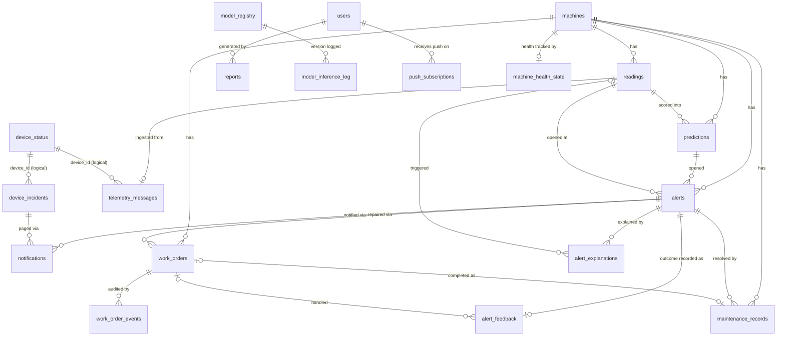
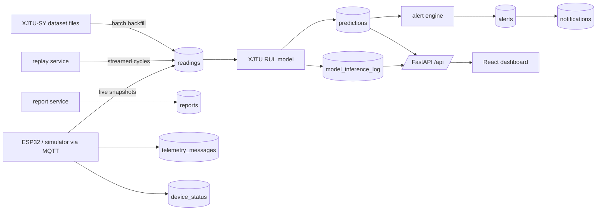

# MaintainIQ Data Model

The living reference for MaintainIQ's data model, ingestion, storage, model
telemetry, and report catalog. Canonical dataset: **XJTU-SY** run-to-failure
bearings. Design of record:
[`docs/superpowers/specs/2026-08-06-xjtu-sy-ml-integration-design.md`](superpowers/specs/2026-08-06-xjtu-sy-ml-integration-design.md).

> Temperature is **not** part of this model. It exists only in the quarantined
> legacy IMS pipeline under `src/legacy/` (synthetic, preserved for possible
> future NASA-IMS validation) and never in the canonical schema or API.

## Entity-relationship diagram


```mermaid
erDiagram
    machines ||--o{ readings : has
    machines ||--o{ predictions : has
    machines ||--o{ alerts : has
    machines ||--o{ maintenance_records : has
    readings ||--o{ predictions : "scored into"
    alerts ||--o{ maintenance_records : "resolved by"
    alerts ||--o{ notifications : "notified via"
    users ||--o{ reports : "generated by"
    model_registry ||--o{ model_inference_log : "version logged"
    readings ||--o| telemetry_messages : "ingested from"
    device_status ||--o{ telemetry_messages : "device_id (logical)"
    device_status ||--o{ device_incidents : "device_id (logical)"
    device_incidents ||--o{ notifications : "paged via"
    machines ||--o{ work_orders : has
    alerts ||--o{ work_orders : "repaired via"
    work_orders ||--o{ work_order_events : "audited by"
    work_orders |o--o| maintenance_records : "completed as"
    alerts ||--o| alert_feedback : "outcome recorded as"
    predictions ||--o{ alerts : "opened"
    readings ||--o{ alerts : "opened at"
    work_orders |o--o{ alert_feedback : "handled"
    alerts ||--o{ alert_explanations : "explained by"
    readings |o--o{ alert_explanations : "triggered"
    users ||--o{ push_subscriptions : "receives push on"
    machines ||--o| machine_health_state : "health tracked by"
```

Notes on the diagram versus a naive reading of the schema: `predictions`
references both `machines` and `readings`, but `reading_id` is nullable, so
not every prediction is tied to a stored reading row (the live/demo path can
score without persisting a reading first). `model_inference_log` carries a
`model_version` string but has no `FOREIGN KEY` to `model_registry` in
`src/storage/db.py` — the relationship is logical (join key), not enforced.
`reports.generated_by` likewise stores a `users.id` value without a declared
foreign key. `telemetry_messages.device_id` and `device_status.device_id`
are likewise a logical join only: a snapshot can arrive before (or without)
any status message from its device, so no foreign key is declared. The same
holds for `device_incidents.device_id`, and `device_incidents.acknowledged_by`
stores a `users.id` without a declared foreign key (as `alerts.acknowledged_by`).
`work_orders.assigned_to` / `created_by` and `work_order_events.user_id` /
`assigned_to` follow the same convention, as do `alerts.closed_by` and
`alert_feedback.recorded_by` / `updated_by`. `alerts.prediction_id` and
`alerts.reading_id` are declared foreign keys but nullable: alerts opened by
the demo routes, the batch backfill or before migration 5 have no link.
`alert_explanations.reading_id` / `prediction_id` are nullable FKs naming the
snapshot's own trigger.

## Tables

### `schema_version`

Migration bookkeeping for the versioned runner in `src/storage/migrations.py`.

| Column | Type | Notes |
| --- | --- | --- |
| `version` | INTEGER NOT NULL | Migration step number that has been applied. |
| `applied_at` | TEXT NOT NULL | Defaults to `datetime('now')`. |

### `machines`

One row per bearing/machine, carrying XJTU-SY metadata.

| Column | Type | Notes |
| --- | --- | --- |
| `machine_id` | TEXT PRIMARY KEY | Stable machine identifier. |
| `bearing_id` | TEXT | XJTU-SY bearing identifier (e.g. `Bearing1_1`). |
| `operating_condition` | INTEGER | XJTU-SY operating condition, one of `1 \| 2 \| 3`. |
| `speed_rpm` | REAL | Nominal shaft speed for the condition. |
| `load_kn` | REAL | Nominal radial load for the condition. |
| `dataset` | TEXT NOT NULL DEFAULT `'xjtu_sy'` | Multi-dataset isolation seam. |
| `is_documented_failure` | INTEGER NOT NULL DEFAULT 0 | 1 if this bearing has a documented run-to-failure end point. |
| `created_at` | TEXT NOT NULL | Defaults to `datetime('now')`. |

### `readings`

Per-cycle windowed feature rows. There is no separate raw-waveform table: the
XJTU-SY ingestion/backfill path produces pre-windowed feature rows directly,
so this table represents both a "raw reading" and its "feature window" at
once (documented limitation in `src/storage/db.py`).

| Column | Type | Notes |
| --- | --- | --- |
| `id` | INTEGER PRIMARY KEY AUTOINCREMENT | |
| `machine_id` | TEXT NOT NULL REFERENCES `machines(machine_id)` | |
| `timestamp` | TEXT NOT NULL | ISO-8601 timestamp of the window. |
| `cycle` | INTEGER NOT NULL | Sequential cycle number for the machine. |
| `elapsed_minutes` | REAL NOT NULL | Minutes elapsed since run start. |
| `speed_rpm` | REAL NOT NULL | |
| `load_kn` | REAL NOT NULL | |
| `sample_rate_hz` | REAL NOT NULL | |
| `vibration_h_rms` | REAL NOT NULL | Horizontal-axis RMS, promoted from `features_json` for queryability. |
| `vibration_h_kurtosis` | REAL NOT NULL | Horizontal-axis kurtosis. |
| `vibration_v_rms` | REAL NOT NULL | Vertical-axis RMS. |
| `vibration_v_kurtosis` | REAL NOT NULL | Vertical-axis kurtosis. |
| `cross_axis_rms_ratio` | REAL NOT NULL | h/v RMS ratio. |
| `cross_axis_correlation` | REAL NOT NULL | h/v correlation. |
| `rul_minutes` | REAL | NULL for live rows without a known ground-truth label. |
| `features_json` | TEXT NOT NULL | Full per-window feature vector (superset of the promoted columns above); new features need no schema change. |
| `dataset` | TEXT NOT NULL DEFAULT `'xjtu_sy'` | |

Constraint: `UNIQUE(machine_id, cycle)` — inserts are idempotent per
machine/cycle (`insert_readings` uses `INSERT OR IGNORE`).
Index: `idx_readings_machine_ts (machine_id, timestamp)`.

### `predictions`

Model output per scored reading.

| Column | Type | Notes |
| --- | --- | --- |
| `id` | INTEGER PRIMARY KEY AUTOINCREMENT | |
| `machine_id` | TEXT NOT NULL REFERENCES `machines(machine_id)` | |
| `reading_id` | INTEGER REFERENCES `readings(id)` | Nullable — not every scored prediction has a persisted reading. |
| `timestamp` | TEXT NOT NULL | |
| `health_state` | TEXT NOT NULL | The **reported** state. With the health ratchet on this is the held level (see [Health state](#health-state-ratchet-epochs-and-resets)), which can be worse than the instant one. |
| `confidence` | REAL | |
| `source` | TEXT NOT NULL DEFAULT `'xjtu_rul'` | Which model/pipeline produced the row. |
| `model_name` | TEXT | |
| `probable_cause` | TEXT | |
| `created_at` | TEXT NOT NULL | Defaults to `datetime('now')`. |
| `predicted_rul_minutes` | REAL | |
| `rul_estimate_kind` | TEXT | `point_estimate \| lower_bound`. |
| `failure_within_horizon_probability` | REAL | |
| `prognostic_horizon_minutes` | REAL | |
| `prediction_interval_low` | REAL | |
| `prediction_interval_high` | REAL | 90% interval bounds (low/high) around the point estimate. |
| `model_version` | TEXT | |
| `out_of_distribution` | INTEGER NOT NULL DEFAULT 0 | Boolean flag stored as 0/1. |
| `history_snapshots` | INTEGER | |
| `warnings_json` | TEXT | |
| `health_epoch` | INTEGER | The machine's health epoch (baseline life) the prediction was made in. NULL for pre-ratchet rows and for results without an epoch (demo, fakes). Rehydrate replays only rows of the current epoch. Added by migration 8. |
| `health_episode` | INTEGER | The alert episode the prediction belongs to. A row is written only if this is still the machine's current episode (conditional `INSERT ... SELECT ... WHERE`); a result overtaken by a reset or re-arm is not persisted. NULL as for `health_epoch`. Added by migration 8. |
| `instant_health_state` | TEXT | The model's own state for this snapshot, before the ratchet, the commissioning gate and the OOD rule. NULL on pre-ratchet rows (read `COALESCE(instant_health_state, health_state)`). Added by migration 8. |

Indexes: `idx_predictions_machine_ts (machine_id, timestamp)`,
`idx_predictions_machine_epoch (machine_id, health_epoch, id)` (migration 8, for
the bounded per-epoch rehydrate).

### `machine_health_state`

The DB authority for a machine's health tracking
(`src/prediction/health_epoch.py`; plan
[`docs/superpowers/plans/2026-10-07-ratchet-maintenance-reset.md`](superpowers/plans/2026-10-07-ratchet-maintenance-reset.md)).
One row per machine; **no row means `(epoch 0, episode 0, 'healthy')`**. Every
write is a single UPSERT statement, conditional where it must be, so racing
connections never hit an `IntegrityError` and a stale write is a no-op inside
SQLite. Resets and re-arms run under `live._TRANSITION_LOCK`, inside the
caller's transaction. Added by migration 8.

| Column | Type | Notes |
| --- | --- | --- |
| `machine_id` | TEXT PRIMARY KEY REFERENCES `machines(machine_id)` | |
| `epoch` | INTEGER NOT NULL DEFAULT 0 | **Baseline life.** Bumped only by a repair reset, which restarts commissioning and rehydrates nothing from the old component. |
| `episode` | INTEGER NOT NULL DEFAULT 0 | **Alert episode.** Bumped by every repair reset and every false-alarm re-arm. Monotonic. |
| `max_state` | TEXT NOT NULL DEFAULT `'healthy'` CHECK(max_state IN ('healthy','degrading','faulty','critical')) | The held (ratcheted) level of the current episode. Only raised, by `record_level`, for a persisted result of the current episode; reset to `healthy` by a reset or re-arm. |
| `model_version` | TEXT | The artifact that derived `max_state`; NULL for a migration seed. A change triggers a re-derive (see below). |
| `epoch_started_at` | TEXT | When the current epoch began (wall clock). NULL for epoch 0. Used by the maintenance date guard. |
| `episode_started_at` | TEXT | When the current episode began. |
| `reset_reason` | TEXT | Audit: `maintenance:{record id}`, `manual_reset:user:{id}`, `replay_restart` or `migration_008_seed`. |
| `updated_at` | TEXT NOT NULL | |

### `model_inference_log`

One row per inference call, for observability (heartbeat + telemetry read
from this table).

| Column | Type | Notes |
| --- | --- | --- |
| `id` | INTEGER PRIMARY KEY AUTOINCREMENT | |
| `machine_id` | TEXT NOT NULL | Not a declared foreign key. |
| `timestamp` | TEXT NOT NULL | |
| `model_version` | TEXT NOT NULL | Logical join key to `model_registry.model_version` (not enforced). |
| `latency_ms` | REAL NOT NULL | |
| `failure_probability` | REAL | |
| `predicted_rul_minutes` | REAL | |
| `out_of_distribution` | INTEGER NOT NULL DEFAULT 0 | |
| `warming_up` | INTEGER NOT NULL DEFAULT 0 | |
| `warnings_count` | INTEGER NOT NULL DEFAULT 0 | |
| `status` | TEXT NOT NULL DEFAULT `'ok'` | `ok \| error`. |
| `error_message` | TEXT | |
| `created_at` | TEXT NOT NULL | Defaults to `datetime('now')`. |

Indexes: `idx_inference_model_ts (model_version, timestamp)`,
`idx_inference_machine_ts (machine_id, timestamp)`.

### `model_registry`

Deployable model versions.

| Column | Type | Notes |
| --- | --- | --- |
| `model_version` | TEXT PRIMARY KEY | |
| `artifact_path` | TEXT NOT NULL | Path to the serialized model artifact. |
| `algorithm` | TEXT | |
| `trained_at` | TEXT | |
| `metrics_json` | TEXT | Serialized evaluation metrics. |
| `deployed_at` | TEXT | |
| `is_active` | INTEGER NOT NULL DEFAULT 0 | Exactly one row is expected to be active at a time. |

### `reports`

Generated report artifacts (see [Report catalog](#report-catalog)).

| Column | Type | Notes |
| --- | --- | --- |
| `id` | INTEGER PRIMARY KEY AUTOINCREMENT | |
| `report_type` | TEXT NOT NULL | `machine_prognostic \| model_performance \| fleet_summary`. |
| `scope` | TEXT NOT NULL | Machine ID for `machine_prognostic`; `"fleet"` for the other two types. |
| `format` | TEXT NOT NULL | `markdown \| json`. |
| `period_start` | TEXT | Nullable filter bound. |
| `period_end` | TEXT | Nullable filter bound. |
| `generated_at` | TEXT NOT NULL | Defaults to `datetime('now')`. |
| `generated_by` | INTEGER | `users.id`; not a declared foreign key. |
| `content` | TEXT NOT NULL | Rendered report body in `format`. |
| `summary_json` | TEXT | Machine-readable summary the `content` was rendered from — the two are always in sync because both derive from one summary dict. |

### `alerts`

Open/resolved machine alerts.

| Column | Type | Notes |
| --- | --- | --- |
| `id` | INTEGER PRIMARY KEY AUTOINCREMENT | |
| `machine_id` | TEXT NOT NULL | Not a declared foreign key. |
| `opened_at` | TEXT NOT NULL | |
| `resolved_at` | TEXT | |
| `severity` | TEXT NOT NULL | |
| `health_state` | TEXT NOT NULL | |
| `probable_cause` | TEXT | |
| `message` | TEXT | |
| `status` | TEXT NOT NULL DEFAULT `'open'` | |
| `source` | TEXT | What opened the episode (`demo` for the admin demo routes, otherwise the prediction source). Demo and real readings keep separate episodes, so a machine can have one open demo alert and one open real alert. |
| `created_at` | TEXT NOT NULL | |
| `acknowledged_at` | TEXT | |
| `acknowledged_by` | INTEGER | |
| `page_level` | INTEGER NOT NULL DEFAULT 0 | Paging ladder level reached (design/2026-10-07-work-orders-escalation-design.md): 0 = the initial page only, 1 = supervisors re-paged, 2 = admins paged. Never lowered; stays as history after acknowledgement. Added by migration 4, which sets it to 2 on every open alert that already exists (as does the batch seed path, `insert_alerts`) so the ladder never pages alerts that predate it; those rows keep `last_paged_at` NULL, which marks "never paged by the ladder". |
| `last_paged_at` | TEXT | When the alert was last paged at any level (the level-0 email included). Added by migration 4. |
| `prediction_id` | INTEGER REFERENCES `predictions(id)` | The prediction that opened the alert (design/2026-10-07-prediction-feedback-design.md). Written on INSERT only and kept through escalation, so it and `opened_at` describe the same instant. NULL for demo/batch alerts and alerts opened before migration 5. Added by migration 5. |
| `reading_id` | INTEGER REFERENCES `readings(id)` | The stored reading behind that prediction (replay and live MQTT; NULL for `POST /api/predictions/rul`, which stores no reading). Same write-once rule. Added by migration 5. |
| `model_version` | TEXT | The opening prediction's model version; groups real-world accuracy per model. Same write-once rule. Added by migration 5. |
| `closed_by` | INTEGER | `users.id` of the person who closed the alert by hand (`POST /api/alerts/{id}/close`); NULL when it auto-resolved or is open. A close sets `status = 'resolved'` and `resolved_at` to the close time — there is no `closed` status. Added by migration 5. |
| `health_episode` | INTEGER | The machine's alert episode when a real alert was inserted (written once, like `prediction_id`). An alert episode is (machine, real kind, `health_episode`). NULL for demo alerts, ratchet-off alerts and alerts opened before migration 8, except the one deploy-seed alert per machine, which migration 8 sets to 0. Added by migration 8. |

Index: `idx_alerts_machine_status (machine_id, status)`. No index on the paging
or link columns: the paging sweep scans open alerts only, and on a legacy database
migration 1 runs `SCHEMA` against an `alerts` table that lacks them.

### `maintenance_records`

Preventive/corrective maintenance history linked to alerts.

| Column | Type | Notes |
| --- | --- | --- |
| `id` | INTEGER PRIMARY KEY AUTOINCREMENT | |
| `machine_id` | TEXT NOT NULL REFERENCES `machines(machine_id)` | |
| `performed_at` | TEXT NOT NULL | |
| `description` | TEXT | |
| `technician` | TEXT | |
| `created_at` | TEXT NOT NULL | |
| `alert_id` | INTEGER REFERENCES `alerts(id)` | |
| `type` | TEXT CHECK(type IN ('preventive','corrective')) | |
| `resets_health` | INTEGER NOT NULL DEFAULT 0 | 1 if writing this record reset the machine's health epoch (a deliberate repair). A property of the record, not of its type; see [Reset rules](#reset-rules-d1-d2). Added by migration 8. |

Every write goes through `src.maintenance.records` (`log_maintenance`, or
`_log_maintenance_locked` inside a work-order completion), so the record and
the health reset it may carry commit together.

### `users`

Auth accounts.

| Column | Type | Notes |
| --- | --- | --- |
| `id` | INTEGER PRIMARY KEY AUTOINCREMENT | |
| `email` | TEXT NOT NULL UNIQUE | |
| `name` | TEXT NOT NULL | |
| `hashed_password` | TEXT NOT NULL | |
| `role` | TEXT NOT NULL CHECK(role IN ('admin','supervisor','operator')) | |
| `is_active` | INTEGER NOT NULL DEFAULT 1 | |
| `created_at` | TEXT NOT NULL | |

### `notifications`

Email and push paging records linked to alerts or to sensor-node incidents.
One row per recipient per email, and one row per push subscription attempted
(a user with two phones gets two push rows). Push rows take `recipient_email`
and `recipient_role` from `users`, and their `subject`/`body` are the push
title and body. Test pushes (`POST /api/push/test`) have both `alert_id` and
`device_incident_id` NULL.

| Column | Type | Notes |
| --- | --- | --- |
| `id` | INTEGER PRIMARY KEY AUTOINCREMENT | |
| `alert_id` | INTEGER REFERENCES `alerts(id)` | NULL for device-health pages. |
| `device_incident_id` | INTEGER REFERENCES `device_incidents(id)` | Set when a sensor node went silent (migration 3); NULL for alert pages. |
| `recipient_email` | TEXT NOT NULL | |
| `recipient_role` | TEXT | |
| `subject` | TEXT NOT NULL | |
| `body` | TEXT NOT NULL | |
| `status` | TEXT NOT NULL DEFAULT `'sent'` | `'sent'` or `'failed'`; an expired push subscription (404/410) is `'failed'`. |
| `channel` | TEXT NOT NULL DEFAULT `'email'` | `'email'` or `'push'`, enforced in code (no CHECK: added to an existing table by migration 7's guarded `ALTER`). Email INSERTs rely on the DEFAULT. |
| `created_at` | TEXT NOT NULL | |

### `telemetry_messages`

M6 live telemetry (design/M6_LIVE_TELEMETRY.md §6). One row per MQTT snapshot
the ingest service processed — accepted, rejected, or errored. Sole source for
the system KPIs (`sensor_collection_rate`, `transmission_success_rate`,
`edge_buffer_health`, `cloud_sync_health`). Added by migration 2.

| Column | Type | Notes |
| --- | --- | --- |
| `id` | INTEGER PRIMARY KEY AUTOINCREMENT | |
| `device_id` | TEXT NOT NULL | Publishing device; `'?'` for rejected messages with no usable id. |
| `boot_id` | TEXT | Random per device boot. |
| `seq` | INTEGER | Per-`(device_id, boot_id)` capture counter; gaps = lost snapshots. |
| `machine_id` | TEXT | Machine the snapshot belongs to (logical link to `machines`). |
| `sampled_at` | TEXT | Device capture time, or `received_at` when the device clock is not NTP-synced. |
| `received_at` | TEXT NOT NULL | Ingest receive time, UTC ISO-8601. Indexed (`idx_telemetry_received`) for KPI windows. |
| `buffered` | INTEGER NOT NULL DEFAULT 0 | 1 = flushed late from the device edge buffer after an outage. |
| `time_synced` | INTEGER NOT NULL DEFAULT 1 | 0 = device clock unsynced; excluded from sync-lag KPIs. |
| `status` | TEXT NOT NULL CHECK(status IN ('accepted','rejected','error')) | |
| `error` | TEXT | Rejection / error reason. |
| `reading_id` | INTEGER REFERENCES `readings(id)` | The `readings` row created for an accepted snapshot. |
| `latency_ms` | REAL | Ingest processing time (decode → fan-out). |
| `payload_bytes` | INTEGER | Raw MQTT payload size. |

`UNIQUE(device_id, boot_id, seq)` is the idempotency key: QoS-1 redeliveries
and re-flushed edge-buffer snapshots are not inserted twice (they are counted
as `duplicates` in the service's in-memory stats). Live readings themselves go
into `readings` with `dataset = 'live_mqtt'`; the raw waveform is not stored.

### `device_status`

Latest retained status / heartbeat per edge device (§4 of the M6 contract),
upserted on every status message — counters are cumulative since device boot,
so only the latest row matters. Added by migration 2.

| Column | Type | Notes |
| --- | --- | --- |
| `device_id` | TEXT PRIMARY KEY | |
| `machine_id` | TEXT | |
| `boot_id` | TEXT | |
| `online` | INTEGER NOT NULL DEFAULT 0 | Last reported online flag (an LWT sets it to 0). |
| `last_seen_at` | TEXT NOT NULL | Last message of ANY kind from this device. |
| `reported_at` | TEXT | Device-side report time. |
| `uptime_s` | REAL | |
| `firmware` | TEXT | |
| `snapshot_interval_s` | REAL | Expected snapshot period (collection-rate denominator). |
| `heartbeat_interval_s` | REAL | Online rule: last message younger than 3 × this (default 10 s). |
| `buffer_depth` | INTEGER | Snapshots currently held in the edge buffer. |
| `buffer_capacity` | INTEGER | |
| `buffer_dropped_total` | INTEGER | Drop-oldest evictions since boot. |
| `publish_attempts_total` | INTEGER | |
| `publish_failures_total` | INTEGER | |
| `wifi_rssi_dbm` | REAL | |
| `payload_json` | TEXT | Full last status payload, for fields not promoted to columns. NULL ⇒ the node never sent a status (row created by a snapshot): state `never_reported`. |

The node's state (`online` / `stale` / `offline` / `never_reported`) is not
stored; it is computed on read by `src/telemetry/device_health.py`, the one
rule shared by ingest, the `/api/telemetry/devices` route, the system KPIs and
the silence watchdog (design/2026-10-06-device-health-design.md, decision 3).

### `device_incidents`

One row per silence episode of a sensor node
(design/2026-10-06-device-health-design.md). Opened and resolved only by the
background watchdog (`src/telemetry/watchdog.py`); acknowledged by any role via
`POST /api/telemetry/incidents/{id}/acknowledge`. Deliberately separate from
`alerts`: alerts are machine-health episodes, and the live alert path would
auto-resolve or escalate a device incident. Added by migration 3.

| Column | Type | Notes |
| --- | --- | --- |
| `id` | INTEGER PRIMARY KEY AUTOINCREMENT | |
| `device_id` | TEXT NOT NULL | The node (logical link to `device_status`). |
| `machine_id` | TEXT | Snapshot of `device_status.machine_id` when opened; may be NULL. |
| `kind` | TEXT NOT NULL CHECK(kind IN ('silent','lwt')) | `lwt`: the stored flag said offline (last will or clean shutdown); `silent`: nothing heard for 3 heartbeats. |
| `status` | TEXT NOT NULL DEFAULT `'open'` CHECK(status IN ('open','resolved')) | Resolved automatically when the node is heard again. |
| `opened_at` | TEXT NOT NULL | Watchdog detection time. |
| `last_seen_at` | TEXT | The node's last-heard time when the incident opened ("silent since"). |
| `resolved_at` | TEXT | |
| `acknowledged_at` | TEXT | Kept when the incident resolves. |
| `acknowledged_by` | INTEGER | `users.id`, no declared FK. |
| `created_at` | TEXT NOT NULL | Same as `opened_at`; kept for parity with `alerts`. |

Indexes: `idx_device_incidents_device_status (device_id, status)`,
`idx_device_incidents_opened (opened_at)`, and the partial unique index
`uq_device_incidents_one_open (device_id) WHERE status = 'open'` — at most one
open incident per node, which makes the watchdog's open path idempotent and
stops a second app instance from paging twice. A later silence of the same
node opens a new row, so every episode is auditable.

### `work_orders`

A tracked repair job (design/2026-10-07-work-orders-escalation-design.md),
raised from an alert by any role (`POST /api/alerts/{id}/work-order`, which
also acknowledges the alert) or free-standing by an admin or supervisor
(`POST /api/work-orders`). Status moves `open → assigned → in_progress → done`
and may be `cancelled` from any non-terminal state; every change also writes a
`work_order_events` row. Completing an order writes a `maintenance_records` row
through `src.maintenance.records.log_maintenance` and links it here, so the
maintenance KPIs keep a single source. Added by migration 4.

| Column | Type | Notes |
| --- | --- | --- |
| `id` | INTEGER PRIMARY KEY AUTOINCREMENT | |
| `alert_id` | INTEGER REFERENCES `alerts(id)` | NULL for free-standing orders. |
| `machine_id` | TEXT NOT NULL REFERENCES `machines(machine_id)` | The alert's machine for alert-raised orders. |
| `status` | TEXT NOT NULL DEFAULT `'open'` CHECK(status IN ('open','assigned','in_progress','done','cancelled')) | `done` and `cancelled` are terminal. |
| `priority` | TEXT NOT NULL DEFAULT `'medium'` CHECK(priority IN ('low','medium','high')) | Defaults from the alert's severity. |
| `title` | TEXT NOT NULL | 1–200 characters; defaults to the alert's message. |
| `description` | TEXT | |
| `assigned_to` | INTEGER | `users.id`, no declared FK. |
| `created_by` | INTEGER | `users.id`, no declared FK. |
| `due_at` | TEXT | Stored and shown only (no reminders). |
| `created_at` | TEXT NOT NULL | |
| `updated_at` | TEXT NOT NULL | Changes on every write; list order is `updated_at DESC, id DESC`. |
| `started_at` | TEXT | Set once, by `start`. |
| `completed_at` | TEXT | Set once, by `complete` (`done` only). |
| `cancelled_at` | TEXT | Set once, by `cancel`. |
| `maintenance_record_id` | INTEGER REFERENCES `maintenance_records(id)` | The corrective (or preventive) record written on completion. |
| `notes` | TEXT | Completion notes. |

Indexes: `idx_work_orders_status (status, machine_id)`,
`idx_work_orders_assignee (assigned_to, status)`, and the partial unique index
`uq_work_orders_one_active_per_alert (alert_id) WHERE alert_id IS NOT NULL AND
status IN ('open','assigned','in_progress')` — at most one active order per
alert, which makes duplicate creation race-free (the API answers 409). Once an
order is done or cancelled it leaves the index, so a new one may be raised for
the same alert; free-standing orders are unconstrained.

### `work_order_events`

Append-only audit trail of a work order: one row per create, edit, assign,
start, complete and cancel. Added by migration 4.

| Column | Type | Notes |
| --- | --- | --- |
| `id` | INTEGER PRIMARY KEY AUTOINCREMENT | |
| `work_order_id` | INTEGER NOT NULL REFERENCES `work_orders(id)` | |
| `event` | TEXT NOT NULL CHECK(event IN ('created','edited','assigned','started','completed','cancelled')) | `created` is always first; it carries the note `from alert #{id}` for alert-raised orders. |
| `from_status` | TEXT | NULL for `created`. A reassignment is an `assigned` event with `from_status = to_status`. |
| `to_status` | TEXT | |
| `user_id` | INTEGER | Who acted (`users.id`, no declared FK). |
| `assigned_to` | INTEGER | The new assignee, on `assigned` events. |
| `note` | TEXT | Assignment note, completion notes or cancel reason. |
| `created_at` | TEXT NOT NULL | |

Index: `idx_work_order_events_order (work_order_id, id)`.

### `alert_feedback`

What actually happened after an alert, recorded by a person
(design/2026-10-07-prediction-feedback-design.md): one row per alert, written
when the alert is closed (`POST /api/alerts/{id}/close`) or later
(`PUT /api/alerts/{id}/feedback`), on open and already-resolved alerts alike.
Any signed-in role may create it; replacing it is limited to its recorder, an
admin or a supervisor, and a replacement is a full one (omitted optional
fields become NULL). Earlier values are not kept. It is the source of
real-world accuracy (`GET /api/model/feedback-accuracy`) and of the retraining
export (`GET /api/model/feedback/export`). Added by migration 5.

| Column | Type | Notes |
| --- | --- | --- |
| `id` | INTEGER PRIMARY KEY AUTOINCREMENT | |
| `alert_id` | INTEGER NOT NULL UNIQUE REFERENCES `alerts(id)` | One row per alert. |
| `outcome` | TEXT NOT NULL CHECK(outcome IN ('confirmed_failure','maintenance_prevented','false_alarm','unknown')) | `maintenance_prevented` is a real fault fixed in time (a true positive); `unknown` is stored but excluded from every accuracy number. |
| `actual_cause` | TEXT CHECK(actual_cause IS NULL OR actual_cause IN ('bearing_wear','imbalance','sensor_or_data_quality_issue','unknown','other')) | The rule-based classifier's labels plus `other`; NULL = not specified. |
| `actual_failure_at` | TEXT | When the machine failed, normalised UTC ISO-8601. Allowed only with `confirmed_failure` (a table CHECK and the service both enforce it). May precede `alerts.opened_at` (the alert came late). |
| `notes` | TEXT | Up to 2000 characters. |
| `work_order_id` | INTEGER REFERENCES `work_orders(id)` | The order that handled the episode; must be for the alert's machine and, if it has an alert, this alert. |
| `recorded_by` | INTEGER NOT NULL | `users.id`, no declared FK. Never changes. |
| `recorded_at` | TEXT NOT NULL | Wall-clock UTC. Never changes. |
| `updated_by` | INTEGER | Who last replaced the row; NULL until the first edit. |
| `updated_at` | TEXT | When it was last replaced. |

Table CHECK: `actual_failure_at IS NULL OR outcome = 'confirmed_failure'`.
Index: `idx_alert_feedback_outcome (outcome)`; `UNIQUE(alert_id)` provides the
per-alert index.

### `alert_explanations`

The evidence behind an alert, for "Why this alert?"
(design/2026-10-07-alert-explanation-design.md). The prediction pipeline
(`src/prediction/pipeline.fan_out`) writes a snapshot when an alert is created
and again at each severity escalation, before paging and broadcasting: the
predictor's rolling context is in memory only, and an escalation overwrites
the alert's `probable_cause`. So one alert has at most one `created` row and up
to two `escalated` rows (low → medium → high). Similar past incidents are never
stored here; `GET /api/alerts/{id}/explanation` computes them when read, and
rebuilds the whole explanation from stored data (`source: "reconstructed"`,
not persisted) for alerts with no snapshot. Rows are never updated. Added by
migration 6.

| Column | Type | Notes |
| --- | --- | --- |
| `id` | INTEGER PRIMARY KEY AUTOINCREMENT | The latest row (highest `id`) for an alert is the one served. |
| `alert_id` | INTEGER NOT NULL REFERENCES `alerts(id)` | |
| `kind` | TEXT NOT NULL CHECK(kind IN ('created','escalated')) | Which transition the snapshot was taken at. |
| `reading_id` | INTEGER REFERENCES `readings(id)` | The reading behind *this* snapshot — for an `escalated` row the escalating reading, which `alerts.reading_id` deliberately does not hold. NULL when there is none (`POST /api/predictions/rul` stores no reading). Not enforced, like `alerts.reading_id`. |
| `prediction_id` | INTEGER REFERENCES `predictions(id)` | The prediction behind this snapshot; NULL for demo alerts (the demo stores no prediction id). |
| `created_at` | TEXT NOT NULL | Wall-clock UTC ISO-8601 at write time. |
| `explanation_json` | TEXT NOT NULL | The snapshot body, versioned by `explanation_version` (currently 1): `triggering_readings` (up to 30 readings ending at the trigger, the six promoted vibration channels only), `key_factors` (deviation from the machine's own baseline × model feature importance; operating conditions reported, not ranked), `prediction` (probability, RUL and interval, `out_of_distribution`, `outside_training_features`, warnings), `probable_cause` (label, rule trace, "probable cause, not a diagnosis" disclaimer), `synthetic` and `notes`. Never contains `similar_incidents`. A body that fails to parse or has an unknown version is reconstructed instead. |

Indexes: `idx_alert_explanations_alert (alert_id, id)`; the partial unique
index `uq_alert_explanations_one_created (alert_id) WHERE kind = 'created'`
allows at most one creation snapshot per alert, so a retried fan-out cannot
double it.

### `push_subscriptions`

Web Push subscriptions for the mobile operator view
(design/2026-10-07-mobile-operator-pwa-design.md). One row per browser push
endpoint, bound to the user who last subscribed on that device:
`POST /api/push/subscribe` upserts on `endpoint`, so the same phone
re-subscribing refreshes its keys and reactivates the row, and a different user
signing in on a shared phone rebinds it to themselves. Unsubscribing
(`DELETE /api/push/subscribe`, or an explicit logout) hard-deletes the caller's
row; a 404/410 from the push service only deactivates it (`is_active = 0`,
`deactivated_at`) so a dead device stays visible. Paging
(`src/notifications/push.push_to_roles`) reads active rows joined to active
users (`users.is_active = 1`); users are deactivated, never deleted, so there
is no `ON DELETE`. Each attempt is logged in `notifications` with
`channel = 'push'`. Added by migration 7.

| Column | Type | Notes |
| --- | --- | --- |
| `id` | INTEGER PRIMARY KEY AUTOINCREMENT | |
| `user_id` | INTEGER NOT NULL REFERENCES `users(id)` | Whoever subscribed last on this device. |
| `endpoint` | TEXT NOT NULL UNIQUE | The push-service URL. A bearer capability: never returned to other users and logged only truncated. Must be `https` on an allowed push-service host (`PUSH_ALLOWED_HOSTS`). |
| `p256dh` | TEXT NOT NULL | Browser public key, base64url (65-byte P-256 point), stored verbatim. |
| `auth` | TEXT NOT NULL | Browser auth secret, base64url (16 bytes), stored verbatim. |
| `user_agent` | TEXT | Request `User-Agent`, truncated to 255 characters. Diagnostics only. |
| `is_active` | INTEGER NOT NULL DEFAULT 1 CHECK(is_active IN (0, 1)) | 0 after the push service answered 404/410. |
| `created_at` | TEXT NOT NULL | |
| `updated_at` | TEXT NOT NULL | Set on every upsert and on deactivation. |
| `last_used_at` | TEXT | Set on each successful push. |
| `deactivated_at` | TEXT | Set on expiry, cleared on reactivation. |

Index: `idx_push_subscriptions_user (user_id, is_active)`.

## Data flow


```mermaid
flowchart LR
    xjtu[XJTU-SY dataset files] -->|batch backfill| readings[(readings)]
    readings --> model[XJTU RUL model]
    model --> predictions[(predictions)]
    model --> inflog[(model_inference_log)]
    predictions --> alertsvc[alert engine] --> alerts[(alerts)]
    alerts --> notif[(notifications)]
    predictions --> api[/FastAPI /api/]
    inflog --> api
    reportsvc[report service] --> reports[(reports)]
    api --> ui[React dashboard]
    replay[replay service] -->|streamed cycles| readings
    mqtt[ESP32 / simulator via MQTT] -->|live snapshots| readings
    mqtt --> telmsg[(telemetry_messages)]
    mqtt --> devstat[(device_status)]
```

Batch backfill (`python -m src.training.xjtu_rul`) loads historical
run-to-failure cycles from the XJTU-SY dataset files in bulk, building the
feature table via `src.ingestion.xjtu_sy.build_feature_table` and training the
model artifact. The streaming replay service
(`src.ingestion.replay_service.ReplayService`) separately re-emits cycles that
are already stored in `readings` back through the live predict-and-persist
path in near-real-time, to demonstrate live behavior without new hardware.
Both paths land rows in `readings` and are scored into `predictions` plus a
`model_inference_log` row per inference call; predictions and their inference
log feed the observability endpoints and reports, and the alert engine turns
qualifying predictions into `alerts`, which fan out to `notifications`.
Each alert create or severity escalation is first snapshotted into
`alert_explanations` (create/escalate → snapshot → page/broadcast), so
"Why this alert?" keeps the evidence the model saw.

## Health state: ratchet, epochs and resets

Plan of record:
[`docs/superpowers/plans/2026-10-07-ratchet-maintenance-reset.md`](superpowers/plans/2026-10-07-ratchet-maintenance-reset.md)
(decision numbers D1–D14 below refer to it). Without it, the predictor could
demote a machine (critical → healthy → critical); each demotion resolved the
open alert and the next reading re-opened and re-paged it (offline: 31
demotions on 10 of the 15 XJTU bearings).

### Held vs instant state

A bearing does not heal. With the ratchet on, the predictor
(`src/prediction/rul_realtime.py`) holds the worst state it has latched:

- `instant_health_state` is the model's own state for the snapshot;
- `health_state` (reported, persisted, alerted on) is
  `max(instant, held)`, and an in-distribution, post-commissioning snapshot
  raises the held level to it;
- `health_state_held` (result only) is true when the two differ; a
  `condition_receded:` warning then says the instant state dropped and the
  level is held until maintenance resets it.

The held level is mirrored in `machine_health_state.max_state` by
`record_level`, in the same transaction as the prediction row, so it survives
restarts.

### Epoch vs episode

| | `epoch` (baseline life) | `episode` (alert episode) |
| --- | --- | --- |
| Bumped by | a repair reset only | every repair reset **and** every false-alarm re-arm |
| Effect on the predictor | forgets all rolling context, restarts commissioning, rehydrates nothing older | restores the held level only; baseline and commissioning untouched |
| Stamped on | `predictions.health_epoch` | `predictions.health_episode`, `alerts.health_episode` |

### Commissioning (D3)

The first `baseline_window` snapshots of an epoch (20 for the deployed
artifact) learn the baseline. During them the reported state is the held
level (`healthy` after a reset), nothing latches, the result carries
`commissioning = {"seen": k, "of": 20}` and a `commissioning:` warning, and no
alert opens. The UI shows "Commissioning k/20" with the instant state as a
secondary badge when it is not healthy. A re-arm does not restart
commissioning.

### Out-of-distribution rows (D8)

A snapshot with more than 10% of its features outside the artifact's
`feature_bounds_99pct` (`out_of_distribution`) is reported as
`max(instant, held)` and can alert as before, but it never raises the held
level; an `ood_not_latched:` warning is added when it would have. A run of OOD
rows therefore behaves like the legacy predictor above the held floor (it can
fall back to the held level and re-page on OOD flapping), and an OOD blip never
holds a machine red until maintenance. The ratchet evidence is XJTU-only. On
the XJTU out-of-fold evaluation (Task 11, 2026-10-07) this rule leaves missed
criticals (8), early pages (2), both bearing lists and C_w5 (6.747) unchanged,
but brings back 3 one-level demotions between non-healthy states on 2
bearings (1_5 faulty → degrading, 3_4 critical → faulty twice): an OOD row
was shown one level above the next in-distribution row and not held (158 of
9216 XJTU rows are OOD). A demotion to a non-healthy state does not resolve
the open alert.

### Alert episodes (D7)

`pipeline.handle_prediction` passes the result's `health_episode` to
`alerts.live.apply_reading` only when the ratchet is on. Then:

1. a result whose episode is not the machine's current one is dropped;
2. an abnormal reading with no open real alert does **not** open one if the
   newest resolved real alert of this episode was closed by a person
   (`closed_by` set) at the same or a higher severity — the held level is
   already acknowledged; a rise in severity opens and pages a new alert;
3. a healthy reading with an open alert resolves it as before (with the
   ratchet this only happens at the start of a new episode).

Independently of the ratchet, `rul_store.persist_prediction` writes a row only
if its `health_episode` is still current (D6); a stale result returns `None`
and every caller skips the alert fan-out (`POST /api/predictions/rul` answers
409, replay and MQTT ingest log it at INFO and continue).

### Reset rules (D1, D2)

A repair reset (`health_epoch._reset_locked`) bumps the epoch and the episode,
sets `max_state = 'healthy'` and system-resolves the machine's open real alert
with `resolved_at` = wall-clock now (never the record's `performed_at`, so MTTR
is never negative). The resolved alerts are broadcast after the commit. Resets
happen only on a deliberate repair:

| Path | Resets when | Who |
| --- | --- | --- |
| `POST /api/maintenance` | only with explicit `reset_health: true`; the default never resets | `reset_health: true` requires admin/supervisor (403 otherwise) |
| Work-order completion (`work_orders.service.complete`) | by default when the order is `corrective`, linked to a real alert of the machine's **current** episode (open or human-closed), and the date guard passes; an explicit `reset_health` wins (the guard still applies). Free-standing, preventive and stale-alert orders do not reset | the assignee or a supervisor/admin |
| `DELETE /api/predictions/rul/{machine_id}/state` | always | admin/supervisor |
| `POST /api/ingestion/replay/start` | always (`replay_restart`): a replay begins a new baseline | admin/supervisor |

**Date guard:** a `performed_at` more than 5 minutes in the future is refused.
A record dated before the current epoch began or before its linked alert
opened is history: with an explicit `reset_health: true` it is refused
("cannot reset health tracking with a record dated before the current
fault"); by default it simply does not reset.

A work-order completion is one transaction (`_LOCK` → `_TRANSITION_LOCK`): the
record, the reset, the default feedback and the status change commit together
or not at all. A completion that resets records the order's alert as
`maintenance_prevented` (D11) unless an outcome already exists; it stays
editable. Supervisor resets through `POST /api/maintenance` invent no feedback.

A replay whose machine is reset by someone else mid-run (for example a work
order completed) stops with `stopped_reason = "health_reset"` (D9); a re-arm
does not stop it.

### False-alarm re-arm (D12)

Closing an alert, or recording its feedback, with outcome `false_alarm` or
actual cause `sensor_or_data_quality_issue` re-arms the machine
(`health_epoch._rearm_locked`) when the alert is real, no longer open, and of
the machine's current episode: the episode is bumped and `max_state` returns
to `healthy`; the epoch, the baseline and commissioning are untouched. The tile
turns green at once (`effective_state`), and the next in-distribution
non-healthy reading latches into the new episode and pages once. Outcomes
`confirmed_failure`, `maintenance_prevented` and `unknown` keep the held level
and the suppression; the machine then needs a repair.

### `effective_state` (D6)

Readers of "the machine's current state" call
`health_epoch.effective_state(conn, machine_id, latest_prediction)`. If the
machine has a `machine_health_state` row and its latest prediction belongs to
an older episode (or is pre-ratchet, `health_episode` NULL), the current state
is `max_state`, flagged `reset_pending_reading`; otherwise it is the
prediction's `health_state`. So after a reset or re-arm with no new reading the
machine shows the post-reset state immediately, without inserting marker
prediction rows.

### Sync, restart and rehydrate (D4, D5)

Every production predictor call goes through
`health_epoch.predict_synced(predictor, conn, machine_id, call)`, which holds a
per-machine lock across sync and predict. The sync compares the predictor
with the DB row: another epoch (a restart or a reset) resets the machine in
memory, rehydrates the current epoch and restores the held level; another
episode only restores the held level. Rehydrate replays only readings joined
to predictions of the current epoch, bounded to the first `baseline_window`
and the last `max_history` rows, using the stored `readings.features_json`
(rows that are empty, unparsable or missing a needed feature are skipped and
logged). A predictor generation counter makes a prediction that was overtaken
by an in-memory reset raise `StaleEpoch`; the caller skips persist and
fan-out. Lock order: `_SYNC_LOCKS[machine]` → `_TRANSITION_LOCK`, and
`work_orders._LOCK` → `_TRANSITION_LOCK`.

### Model change (D10)

When `machine_health_state.model_version` differs from the loaded artifact's,
the first synced prediction replays the whole current epoch once with the new
model, takes the level it latches over the current episode's rows, floors it
at the state of the machine's open real alert (a model change never silently
resolves an alert), and writes it with the new `model_version`, conditional on
the episode. A NULL `model_version` (a migration seed) adopts the current model
and keeps its level.

### Deploy seed (D14)

Migration 8 seeds at most one row per machine from its `xjtu_rul` alerts: the
worst open one, else the newest resolved one later than the machine's latest
maintenance, if a person closed it and its feedback is not `false_alarm` or
`sensor_or_data_quality_issue`. The seed row is `(epoch 0, episode 0,
max_state = alert.health_state, model_version NULL)` and the seed alert gets
`health_episode = 0`, so a pre-deploy open alert is not resolved by the first
cold reading and a pre-deploy closed one is not re-paged.

### Kill switch (D13)

The ratchet is **on** by default. Resolution order: the
`RealTimeRULPredictor(ratchet=...)` argument, then env
`MAINTAINIQ_HEALTH_RATCHET` (`0|false|off|no` or `1|true|on|yes`; anything else
is an error), then the artifact's `health_ratchet` key (default true). Every
result carries `health_ratchet`. Off gives the exact legacy `health_state` (no
commissioning gate, no latch, no OOD rule), no `record_level`, and no episode
suppression in the alert engine. Epoch stamping, resets, the stale-persist
skip, re-arm bookkeeping and `effective_state` still run; they are neutral
while `max_state` stays `healthy`.

## Ingestion modes

- **Batch backfill** — bulk load of the XJTU-SY dataset into `readings`. Entry
  point (per README):
  ```bash
  python -m src.training.xjtu_rul --data-dir /path/to/XJTU-SY_Bearing_Datasets --rebuild-features
  ```
  This regenerates `models/xjtu_rul_model.joblib` and an evaluation report
  (`models/xjtu_rul_evaluation.json`) from the dataset files using strict
  leave-one-bearing-out validation. Full details and the real-time API
  contract are in [`research/XJTU_SY_MODEL_CARD.md`](../research/XJTU_SY_MODEL_CARD.md).
- **Streaming replay** — the replay service
  (`src/api/routes/ingestion.py`, `src/ingestion/replay_service.py`) re-emits
  cycles already stored in `readings` over time, driving them back through the
  live predict+persist path:
  - `POST /api/ingestion/replay/start` — body `{machine_id: str, speed_multiplier: float = 1.0}`.
    Response: `{machine_id, status: "started", speed_multiplier}`. Requires
    `admin` or `supervisor`.
  - `POST /api/ingestion/replay/stop` — body `{machine_id: str}`. Response:
    `{machine_id, status: "stopped"}`. Requires `admin` or `supervisor`.
  - `GET /api/ingestion/replay/status` — returns the `ReplayService`'s
    machine-keyed status map. Any authenticated role may read it.

- **Live MQTT telemetry (M6)** — ESP32 nodes or the simulator
  (`python -m src.telemetry.simulator`) publish snapshots to
  `maintainiq/v1/telemetry/{machine_id}` and retained status to
  `maintainiq/v1/status/{device_id}`; the ingest service decodes each snapshot
  (`src/telemetry/protocol.py`), stores a `readings` row
  (`dataset = 'live_mqtt'`), runs it through the same prediction fan-out as
  replay, and records delivery metadata in `telemetry_messages` /
  `device_status`. Enabled only when `MQTT_BROKER_HOST` is set. Full contract:
  [`design/M6_LIVE_TELEMETRY.md`](../design/M6_LIVE_TELEMETRY.md).

## Storage layout

SQLite single-file database. Default path is
`<repo_root>/maintainiq.db`, overridable via the `MAINTAINIQ_DB_PATH`
environment variable (e.g. to point at a mounted volume in Docker, since the
file then lives outside the repo tree).

Schema application goes through a versioned migration runner
(`src/storage/migrations.py`) backed by the `schema_version` table:
`db.init_schema()` delegates to `migrations.run_migrations()`, which applies
every step whose version exceeds the current stamped version. Migration 1
establishes the XJTU-SY canonical baseline: on a legacy IMS database the
dataset tables (`machines`/`readings`/`predictions`) are dropped and recreated
in the canonical shape (regenerated from XJTU-SY via backfill, not
data-migrated), while the app tables (`alerts`, `maintenance_records`,
`users`, `notifications`) are preserved and upgraded in place via guarded
`ALTER` statements. Migration 2 is additive: it creates the M6
`telemetry_messages` and `device_status` tables (`IF NOT EXISTS`), so an
existing v1 database upgrades without touching any row. Migration 3 (device
health) is additive too: it creates `device_incidents` with its indexes and adds
the nullable `notifications.device_incident_id` through a guarded `ALTER`
(one mixed step — `executescript` commits first and the `ALTER` is idempotent,
so a crash between the two re-runs cleanly). Migration 4 (work orders and
alert paging) has the same additive, mixed shape: it creates `work_orders` and
`work_order_events` with their indexes, then adds `alerts.page_level` and
`alerts.last_paged_at` through guarded `ALTER`s, and marks the open alerts it
finds as already at the top paging level (`page_level = 2`, `last_paged_at`
NULL). Migration 5 (prediction
feedback) has the same shape again: it creates `alert_feedback` and its index,
then adds the nullable `alerts.prediction_id`, `reading_id`, `model_version` and
`closed_by` through guarded `ALTER`s. Migration 6 (alert explanations) is
purely additive, one `executescript`, like migration 2: it creates
`alert_explanations` and its two indexes. Migration 7 (mobile operator view)
is additive with the mixed shape of migration 3: it creates
`push_subscriptions` and its index, then adds `notifications.channel`
(`DEFAULT 'email'`, so every existing row reads as an email) through a guarded
`ALTER`. Migration 8 (health epoch) has the same mixed shape: it creates
`machine_health_state`, adds `predictions.health_epoch`, `health_episode`,
`instant_health_state`, `alerts.health_episode` and
`maintenance_records.resets_health` through guarded `ALTER`s, creates
`idx_predictions_machine_epoch`, and seeds held levels from pre-deploy
`xjtu_rul` alerts with `INSERT OR IGNORE` (see
[Deploy seed](#deploy-seed-d14)); legacy prediction rows keep NULL stamps
("pre-ratchet"). Migrations are still not run at
app start. Instead `migrations.ensure_current_schema` brings a versioned but
stale file up to date lazily: the first request through `src/api/deps.get_db`
(memoised per file afterwards), the paging job's first tick, and — via
`ingest.ensure_telemetry_schema` — live ingest's first message and the silence
watchdog's first armed tick. A file below version 1 (empty or legacy IMS) is
never touched by these paths, because migration 1 drops dataset tables and that
stays an explicit backfill decision. A second call to `run_migrations` is a
no-op.

The `dataset` column on `machines` and `readings` (default `'xjtu_sy'`) is the
multi-dataset isolation seam, reserved for onboarding a second dataset without
schema changes.

## Model heartbeat & telemetry contract

Both endpoints are mounted under `Depends(get_current_user)` in `src/api/app.py`,
so any authenticated role may read them (no PII in either response). They are
implemented in `src/api/routes/model.py`, which delegates to
`src.observability.model_health` and `src.observability.telemetry`.

### `GET /api/model/health`

Computed by `model_health.compute_health()`: reports whether a successful
inference is recent enough to call the model live, against a configurable
staleness window (env `MAINTAINIQ_MODEL_HEARTBEAT_SECONDS`, default 900
seconds).

| Field | Type | Meaning |
| --- | --- | --- |
| `status` | string | `"healthy"` if the last `ok` inference in `model_inference_log` is within the staleness window, else `"stale"`. |
| `model_version` | string \| null | `model_version` of the row in `model_registry` with `is_active = 1`. |
| `last_inference_at` | string \| null | Timestamp of the most recent `status = 'ok'` row in `model_inference_log`. |
| `seconds_since_last_inference` | number \| null | `now - last_inference_at`, in seconds. |
| `active` | boolean | Whether an active model row exists in `model_registry`. |

### `GET /api/model/telemetry?window_minutes=<n>`

Computed by `telemetry.compute_telemetry()`: rolling aggregates over
`model_inference_log` for rows with `timestamp >= now - window_minutes`
(`window_minutes` defaults to 60, must be `> 0`).

| Field | Type | Meaning |
| --- | --- | --- |
| `window_minutes` | number | Echo of the requested window. |
| `inference_count` | integer | Total rows in the window. |
| `error_rate` | number | `errors / total` (0.0 if no rows). |
| `latency_p50_ms` | number \| null | Nearest-rank 50th percentile of `latency_ms`. |
| `latency_p95_ms` | number \| null | Nearest-rank 95th percentile of `latency_ms`. |
| `ood_rate` | number | Fraction of `status='ok'` rows with `out_of_distribution = 1`. |
| `warming_up_rate` | number | Fraction of `status='ok'` rows with `warming_up = 1`. |

### `GET /api/model/feedback-accuracy`

Real-world accuracy from operator feedback (`src.feedback.accuracy.real_world_accuracy`,
design/2026-10-07-prediction-feedback-design.md, decision 9). Query parameters:
`model_version` (exact match on `alerts.model_version`), `period_start` /
`period_end` (ISO-8601 bounds on `alerts.created_at`, the wall clock; 400 if
unparseable). Demo alerts (`source = 'demo'`) are always excluded. Every key is
always present; with nothing labelled, `status` is `not_applicable` and the
rates are null.

| Field | Type | Meaning |
| --- | --- | --- |
| `status` / `reason` | string / string \| null | `available`, or `not_applicable` with `no labelled alerts yet` / `alert_feedback table not present`. |
| `model_version`, `period` | | Echo of the filters. |
| `horizon_minutes` | number | The default prognostic horizon (120). |
| `feedback_count` / `labelled_count` | integer | All feedback rows / those whose outcome is not `unknown`. |
| `outcome_counts` | object | Count per outcome. |
| `precision` | number \| null | `(confirmed_failure + maintenance_prevented) / labelled`. |
| `false_alarm_rate` | number \| null | `false_alarm / labelled`. |
| `lead_time` | object | Over `confirmed_failure` rows with `actual_failure_at`: `actual_failure_at - opened_at` in minutes (`count`, `mean_minutes`, `median_minutes`, `min_minutes`, `max_minutes`), bucketed against the opening prediction's `prognostic_horizon_minutes` (else 120) into `within_horizon_count`, `early_count` (lead > horizon) and `late_count` (failure before the alert). |
| `rul_error` | object | Opening prediction vs. that lead time: `mae_minutes` / `median_abs_error_minutes` over `point_estimate` predictions only (`point_estimate_count`); `lower_bound` predictions are censored, so only `lower_bound_count` and `lower_bound_respected_count` (lead ≥ predicted). |
| `root_cause` | object | `labelled_count`, `correct_count`, `accuracy` over feedback with an `actual_cause` other than NULL/`unknown`; a hit is `alerts.probable_cause == actual_cause` (`other` always misses). |
| `missed_failures` | object | Always `not_applicable`: a failure that raised no alert has nothing to label. |
| `by_model_version` | array | `model_version`, `feedback_count`, `labelled_count`, `precision`, `false_alarm_rate`, `median_lead_minutes`, `rul_mae_minutes`, `root_cause_accuracy` per version, newest first; pre-link alerts (NULL version) last. |
| `offline` | object \| null | `model_registry.metrics_json["failure_detection"]` for the filtered (else active) model: `model_version`, `precision`, `recall`, `false_alarm_count`, `missed_failure_window_count`. Per-snapshot, so shown beside the field numbers, never subtracted. Null when absent. |
| `exportable_episode_count` | integer | Feedback rows the export below would turn into episodes. |

The KPI `prediction` block carries a compact `real_world` object (`status`,
`reason`, `labelled_count`, `precision`, `false_alarm_rate`,
`median_lead_minutes`, `rul_mae_minutes`), and `root_cause_accuracy` switches to
`{status: "available", accuracy, labelled_count, correct_count, source:
"operator_feedback"}` once feedback names a cause. The `model_performance`
report gains the full object as `real_world`.

### `GET /api/model/feedback/export`

Admin/supervisor only. `text/csv` attachment
`maintainiq-feedback-features-YYYYMMDD.csv` with headers `X-Episode-Count` and
`X-Row-Count` (`src.feedback.export`, decision 14); also available as
`python -m src.feedback.export`. One episode per `confirmed_failure` with an
`actual_failure_at` on a non-demo alert (optional `model_version` filter). Rows
are that machine's live MQTT readings (`readings.dataset = 'live_mqtt'`) with
`episode_start < timestamp <= actual_failure_at`, where `episode_start` is the
latest maintenance record before the alert opened or earlier recorded failure
on the machine. Columns follow `build_feature_table`:

| Column | Meaning |
| --- | --- |
| `bearing_id` | `"{machine_id}:fb{feedback_id}"` — unique per episode. |
| `condition` | `machines.operating_condition` (empty when unknown). |
| `cycle` | 0..n−1 in time order. |
| `elapsed_minutes` | Minutes since the episode's first reading. |
| `rul_minutes` | Minutes from the reading to `actual_failure_at`. |
| `speed_rpm`, `load_kn` | From the reading. |
| `source_file` | `"reading:{id}"`. |
| feature columns | The `features_json` keys (first row's order, extra keys sorted). Rows with empty/unparseable features or missing a rolling source column (`xjtu_rul.ROLLING_SOURCE_COLUMNS`) are skipped. |

An export with no episodes is the header row only.

## Report catalog

Implemented by `src/api/routes/reports.py` (endpoints) and
`src/reports/service.py` + `src/reports/generators.py` (summary building and
rendering). Every endpoint requires an authenticated session
(`Depends(get_current_user)`); per-type RBAC is enforced inside each handler.

**Report types** (`generators.REPORT_TYPES`): `machine_prognostic`,
`model_performance`, `fleet_summary`.

**Formats** (`generators.FORMATS`): `markdown`, `json`.

**Per-type RBAC**: operators may generate/read `machine_prognostic` only;
`model_performance` and `fleet_summary` require `admin` or `supervisor`
(`_ELEVATED_TYPES` in `reports.py`). `machine_prognostic` additionally
validates that `scope` is a known `machine_id` (404 if not).

**Endpoints:**

- `POST /api/reports` — body: `{report_type, scope, format="json", period_start=None, period_end=None}`
  (`ReportCreateRequest`). Builds the summary via `generators.build_summary`,
  renders `content` via `generators.render`, persists both (plus
  `summary_json`) into `reports`, and returns the presented row (see below).
- `GET /api/reports?scope=<scope>` — lists reports, newest first; operators
  are transparently filtered to `report_type = 'machine_prognostic'`.
- `GET /api/reports/{report_id}` — fetch one report; 404 if missing, 403 if
  the caller's role isn't authorized for its `report_type`.
- `GET /api/reports/{report_id}/download` — same authorization as above;
  returns the raw `content` with `Content-Type` `text/markdown` or
  `application/json` and a `Content-Disposition: attachment` header
  (`report-{id}.md` or `report-{id}.json`).

Every read path (`GET` endpoints and the `POST` response) "presents" the
stored row: `summary_json` is parsed back into a `summary` object and the raw
JSON string field is dropped from the response.

Per-type summary contents (`generators.py`):

- **`machine_prognostic`** (scope = a `machine_id`): `prediction_count`,
  `current` (latest prediction: health state, predicted RUL, RUL estimate
  kind, prediction interval, failure-within-horizon probability, OOD flag,
  probable cause, model version, confidence), `health_state_trajectory` (last
  10 predictions), `recent_alerts` (last 10 alerts), and
  `recommended_maintenance` (`within_minutes`/`by_timestamp` derived from the
  current predicted RUL).
- **`model_performance`** (scope = `"fleet"`): `inference_count`,
  `error_count`, `error_rate`, `latency_p50_ms`, `latency_p95_ms`, `ood_rate`,
  `warming_up_rate` (all over `model_inference_log`), plus `active_model`
  (version, algorithm, trained_at, parsed metrics) from `model_registry`.
- **`fleet_summary`** (scope = `"fleet"`): `machine_count`,
  `health_distribution` (counts per health state from each machine's latest
  prediction), `top_at_risk` (5 machines with lowest predicted RUL),
  `alert_counts` (total/open/resolved), `maintenance_counts`
  (total/preventive/corrective).

All three summaries also carry `report_type`, `scope`, and
`period: {start, end}`.
