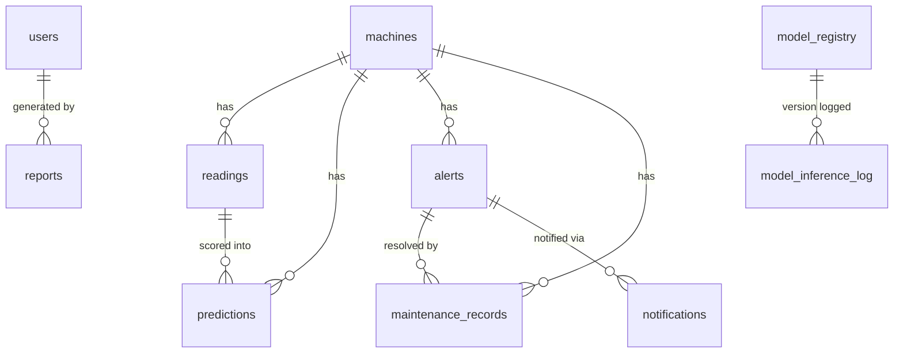
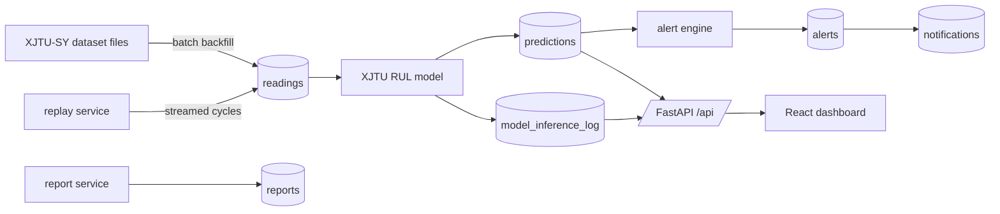

# Phase 8 — Documentation Reconciliation Implementation Plan

> **For agentic workers:** REQUIRED SUB-SKILL: Use superpowers:subagent-driven-development (recommended) or superpowers:executing-plans to implement this plan task-by-task. Steps use checkbox (`- [ ]`) syntax for tracking.

**Goal:** The repository's documentation and any remaining runtime-visible copy describe what actually shipped — an XJTU-SY-native data model with temperature quarantined to legacy — anchored by a new living `docs/DATA_MODEL.md`.

**Architecture:** This is the final, documentation-only phase. It (1) fixes the one stale dataset reference that is returned to API clients plus the storage docstring that contradicts the schema it describes, (2) authors `docs/DATA_MODEL.md` as the living data-model reference the spec's §11.2 requires, and (3) reconciles `design/DESIGN_BASELINE.md`, `design/FAN_DATASET_CATALOG.md`, and `README.md` with the shipped system. Consistency is enforced by lightweight structural tests that read the docs and assert coverage/absence, so the docs can't silently drift from the schema.

**Tech Stack:** Python 3.12, pytest 9 (doc-consistency tests read files via `pathlib`), Markdown with GitHub-native Mermaid fenced blocks (no new dependency — GitHub renders ```mermaid``` without any toolchain).

## Global Constraints

- **XJTU-SY is canonical.** Temperature is a **legacy-only** synthetic concept, quarantined under `src/legacy/` and intentionally **preserved, not deleted** (design spec §5, §7: legacy IMS code is import-guarded and kept for future NASA validation). It is absent from the canonical data model, schema, and API. Documentation states this; it does **not** remove temperature from legacy.
- **The canonical schema is the committed `src/storage/db.py` `SCHEMA` string** (reproduced verbatim in Task 2 below). `docs/DATA_MODEL.md` must mirror it exactly — every table name and every column name — or the Task 2 consistency test fails.
- **RUL is expressed in minutes.** Predictions carry `predicted_rul_minutes`, `rul_estimate_kind`, `failure_within_horizon_probability`, `out_of_distribution`. No temperature fields anywhere in canonical docs.
- **Do NOT modify** `src/legacy/**` (preserved quarantine), `tests/storage/test_migrations.py` (its `temperature_c` references are *removal assertions* — `assert "temperature_c" not in cols` — and are correct), or the IMS references in `src/storage/migrations.py` (they correctly describe dropping legacy IMS-shaped tables during migration). Leave the historical-lineage docstrings in `src/features/vibration.py`, `src/root_cause/rule_based.py`, `src/preprocessing/cleaning.py`, and `src/maintenance/records.py` untouched — they accurately describe the feature set's origin or M6 placeholders and are not the subject of this phase.
- **`design/DESIGN_BASELINE.md` remains the canonical scope authority.** Only its `ML model selection`, `Alert triggering`, `Storage`, and `Temperature sensor` rows are reconciled, by pointing them at the design spec — do not rewrite unrelated decision rows.
- **No new runtime dependencies.** This phase edits Markdown docs, two code comments/strings, and adds pytest doc-consistency tests only.
- **Design spec wins over the roadmap on conflict.** Spec of record: `docs/superpowers/specs/2026-08-06-xjtu-sy-ml-integration-design.md`.
- DRY, YAGNI, TDD, frequent commits.

---

## File Structure

- `src/kpi/calculations.py` — MODIFY one runtime-returned string (`prediction_kpis()` root-cause reason). Active code, user-facing value.
- `src/storage/db.py` — MODIFY the module docstring only (it describes the `readings` table design using IMS-specific rationale that contradicts the canonical schema).
- `tests/test_kpi.py` — MODIFY to assert the corrected reason string.
- `docs/DATA_MODEL.md` — CREATE. The living data-model reference (spec §11.2).
- `tests/docs/test_data_model_doc.py` — CREATE. Structural consistency test: every `db.py` table documented, required sections present, no canonical `temperature_c`.
- `design/DESIGN_BASELINE.md` — MODIFY four decision rows to point at the spec.
- `design/FAN_DATASET_CATALOG.md` — MODIFY the now-false schema claims (temperature_c removed; `speed_rpm`/`load_kn` now real columns; IMS/`ml_model.py` archived).
- `README.md` — MODIFY tagline, add XJTU backfill/replay run instructions + `docs/DATA_MODEL.md` link, correct the "older IMS stage classifier" framing.
- `tests/docs/test_docs_reconciliation.py` — CREATE. Structural test: README/baseline/catalog reconciled (key strings present/absent).

---

## Task 1: Reconcile stale dataset references in active code

**Files:**
- Modify: `src/kpi/calculations.py:237-241` (the `root_cause_accuracy` reason string returned by `prediction_kpis()`)
- Modify: `src/storage/db.py:1-22` (module docstring)
- Test: `tests/test_kpi.py` (`test_prediction_kpis_shape`)

**Interfaces:**
- Consumes: nothing from other Phase 8 tasks.
- Produces: nothing other tasks depend on. Independent; may be done first.

**Context:** `prediction_kpis()` returns a dict that flows straight into the `/api/kpis` response. Its `root_cause_accuracy.reason` currently says "no labeled root-cause ground truth in the **IMS dataset**". The platform now runs on XJTU-SY. The *reasoning* still holds for XJTU-SY (it documents run-to-failure bearing wear but does not label other root causes), so only the dataset name changes. The `db.py` module docstring separately explains the `readings` table using IMS-specific facts ("the IMS ingestion path ... only ever produces pre-windowed feature rows", "IMS Test 1 has a second vibration channel that Tests 2/3 lack") — under XJTU-SY every bearing has both horizontal and vertical channels, so that rationale is now inaccurate for the very table `docs/DATA_MODEL.md` will document.

- [ ] **Step 1: Update the failing test first**

In `tests/test_kpi.py`, `test_prediction_kpis_shape` currently asserts only the status. Add an assertion pinning the corrected copy. Replace the body of `test_prediction_kpis_shape` (currently around lines 50-55) with:

```python
def test_prediction_kpis_shape():
    pred = kpi.prediction_kpis()
    # Model-quality KPIs reshaped from the evaluation report; may be
    # "available" or "not_applicable" depending on whether the report exists.
    assert pred["status"] in ("available", "not_applicable")
    if pred["status"] == "available":
        assert pred["root_cause_accuracy"]["status"] == "not_applicable"
        reason = pred["root_cause_accuracy"]["reason"]
        # Platform runs on XJTU-SY now; the stale "IMS dataset" copy must be gone.
        assert "XJTU-SY" in reason
        assert "IMS" not in reason
```

If the existing test asserts `pred["status"] == "available"` unconditionally (i.e. the evaluation report is present in the test environment), keep that stronger assertion instead of the `in (...)` form — match whatever the current test already relies on, but add the two `reason` assertions.

- [ ] **Step 2: Run the test to verify it fails**

Run: `cd C:/projects/MaintainIQ && python -m pytest tests/test_kpi.py::test_prediction_kpis_shape -v`
Expected: FAIL — the reason still contains "IMS" and lacks "XJTU-SY".

- [ ] **Step 3: Fix the runtime string**

In `src/kpi/calculations.py`, in `prediction_kpis()`, change the `root_cause_accuracy` reason (lines 237-241) to:

```python
        "root_cause_accuracy": {
            "status": _NOT_APPLICABLE,
            "reason": "no labeled root-cause ground truth in the XJTU-SY dataset "
                      "(run-to-failure bearing wear is documented, but specific "
                      "root causes are not labeled)",
        },
```

- [ ] **Step 4: Fix the storage docstring**

In `src/storage/db.py`, replace the module docstring (lines 1-22) with copy that describes the canonical XJTU-SY `readings` table without the IMS-specific rationale:

```python
"""SQLite schema and access for the storage layer.

Design note (documented limitation, per this project's "flag limitations"
convention): the original plan called for separate "raw readings" and
"feature windows" tables, but the XJTU-SY ingestion/backfill path produces
pre-windowed feature rows — there is no raw waveform retained alongside them.
The `readings` table below therefore represents both at once (one row per
machine per cycle, holding its extracted features). A future M6 raw-telemetry
source that windows on the fly would be the first real user of a genuinely
separate raw-readings table.

Each XJTU-SY bearing is instrumented on two axes (horizontal + vertical), so
the columns every downstream module filters or sorts on (vibration_h_rms,
vibration_h_kurtosis, vibration_v_rms, vibration_v_kurtosis,
cross_axis_rms_ratio, cross_axis_correlation) are promoted to real columns for
queryability; the full per-window feature vector still lives in the
`features_json` blob so new features need no schema change.

See docs/DATA_MODEL.md for the full table-by-table reference.
"""
```

- [ ] **Step 5: Run the test to verify it passes**

Run: `cd C:/projects/MaintainIQ && python -m pytest tests/test_kpi.py -v`
Expected: PASS.

- [ ] **Step 6: Run the storage + KPI suites to confirm no regression**

Run: `cd C:/projects/MaintainIQ && python -m pytest tests/test_kpi.py tests/storage/ -q`
Expected: PASS (the docstring change is comment-only; storage tests unaffected).

- [ ] **Step 7: Commit**

```bash
git add src/kpi/calculations.py src/storage/db.py tests/test_kpi.py
git commit -m "docs(phase8): reconcile stale IMS references in active code to XJTU-SY"
```

---

## Task 2: Author docs/DATA_MODEL.md (living data-model reference)

**Files:**
- Create: `docs/DATA_MODEL.md`
- Create: `tests/docs/test_data_model_doc.py`

**Interfaces:**
- Consumes: the canonical `SCHEMA` from `src/storage/db.py` (reproduced verbatim below — the source of truth) and the shipped API contracts (route files cited below).
- Produces: `docs/DATA_MODEL.md` at the repo root's `docs/`. README (Task 3) links to it.

**Context:** Spec §11.2 requires a living reference containing: ER diagram, table-by-table columns, data-flow diagram, ingestion modes (streaming vs batch), storage layout, model heartbeat/telemetry contract, and report catalog. The doc must mirror the committed schema exactly. The contract sources to transcribe from (read them; do not invent):
- Schema: `src/storage/db.py` `SCHEMA` (verbatim below).
- Model heartbeat/telemetry: `src/api/routes/model.py` (endpoints `GET /api/model/health`, `GET /api/model/telemetry`) and `src/model/observability` (or wherever `model.py` imports its service from — follow the import).
- Ingestion/replay: `src/api/routes/ingestion.py` (`POST /api/ingestion/replay/start`, `POST /api/ingestion/replay/stop`, `GET /api/ingestion/replay/status`) and the backfill entrypoint `src/training/xjtu_rul.py` / the backfill script the README references.
- Report catalog: `src/api/routes/reports.py` + `src/reports/service.py` (types `machine_prognostic | model_performance | fleet_summary`; formats `markdown | json`; per-type RBAC: operators → `machine_prognostic` only).

**Canonical schema — the source of truth for the table-by-table section (reproduce every table and column):**

```sql
CREATE TABLE IF NOT EXISTS schema_version (
    version     INTEGER NOT NULL,
    applied_at  TEXT NOT NULL DEFAULT (datetime('now'))
);

CREATE TABLE IF NOT EXISTS machines (
    machine_id            TEXT PRIMARY KEY,
    bearing_id            TEXT,
    operating_condition   INTEGER,
    speed_rpm             REAL,
    load_kn               REAL,
    dataset               TEXT NOT NULL DEFAULT 'xjtu_sy',
    is_documented_failure INTEGER NOT NULL DEFAULT 0,
    created_at            TEXT NOT NULL DEFAULT (datetime('now'))
);

CREATE TABLE IF NOT EXISTS readings (
    id                     INTEGER PRIMARY KEY AUTOINCREMENT,
    machine_id             TEXT NOT NULL REFERENCES machines(machine_id),
    timestamp              TEXT NOT NULL,
    cycle                  INTEGER NOT NULL,
    elapsed_minutes        REAL NOT NULL,
    speed_rpm              REAL NOT NULL,
    load_kn                REAL NOT NULL,
    sample_rate_hz         REAL NOT NULL,
    vibration_h_rms        REAL NOT NULL,
    vibration_h_kurtosis   REAL NOT NULL,
    vibration_v_rms        REAL NOT NULL,
    vibration_v_kurtosis   REAL NOT NULL,
    cross_axis_rms_ratio   REAL NOT NULL,
    cross_axis_correlation REAL NOT NULL,
    rul_minutes            REAL,
    features_json          TEXT NOT NULL,
    dataset                TEXT NOT NULL DEFAULT 'xjtu_sy',
    UNIQUE(machine_id, cycle)
);

CREATE TABLE IF NOT EXISTS predictions (
    id                                 INTEGER PRIMARY KEY AUTOINCREMENT,
    machine_id                         TEXT NOT NULL REFERENCES machines(machine_id),
    reading_id                         INTEGER REFERENCES readings(id),
    timestamp                          TEXT NOT NULL,
    health_state                       TEXT NOT NULL,
    confidence                         REAL,
    source                             TEXT NOT NULL DEFAULT 'xjtu_rul',
    model_name                         TEXT,
    probable_cause                     TEXT,
    created_at                         TEXT NOT NULL DEFAULT (datetime('now')),
    predicted_rul_minutes              REAL,
    rul_estimate_kind                  TEXT,
    failure_within_horizon_probability REAL,
    prognostic_horizon_minutes         REAL,
    prediction_interval_low            REAL,
    prediction_interval_high           REAL,
    model_version                      TEXT,
    out_of_distribution                INTEGER NOT NULL DEFAULT 0,
    history_snapshots                  INTEGER,
    warnings_json                      TEXT
);

CREATE TABLE IF NOT EXISTS model_inference_log (
    id                     INTEGER PRIMARY KEY AUTOINCREMENT,
    machine_id             TEXT NOT NULL,
    timestamp              TEXT NOT NULL,
    model_version          TEXT NOT NULL,
    latency_ms             REAL NOT NULL,
    failure_probability    REAL,
    predicted_rul_minutes  REAL,
    out_of_distribution    INTEGER NOT NULL DEFAULT 0,
    warming_up             INTEGER NOT NULL DEFAULT 0,
    warnings_count         INTEGER NOT NULL DEFAULT 0,
    status                 TEXT NOT NULL DEFAULT 'ok',
    error_message          TEXT,
    created_at             TEXT NOT NULL DEFAULT (datetime('now'))
);

CREATE TABLE IF NOT EXISTS model_registry (
    model_version  TEXT PRIMARY KEY,
    artifact_path  TEXT NOT NULL,
    algorithm      TEXT,
    trained_at     TEXT,
    metrics_json   TEXT,
    deployed_at    TEXT,
    is_active      INTEGER NOT NULL DEFAULT 0
);

CREATE TABLE IF NOT EXISTS reports (
    id            INTEGER PRIMARY KEY AUTOINCREMENT,
    report_type   TEXT NOT NULL,
    scope         TEXT NOT NULL,
    format        TEXT NOT NULL,
    period_start  TEXT,
    period_end    TEXT,
    generated_at  TEXT NOT NULL DEFAULT (datetime('now')),
    generated_by  INTEGER,
    content       TEXT NOT NULL,
    summary_json  TEXT
);

CREATE TABLE IF NOT EXISTS alerts (
    id INTEGER PRIMARY KEY AUTOINCREMENT,
    machine_id TEXT NOT NULL,
    opened_at TEXT NOT NULL,
    resolved_at TEXT,
    severity TEXT NOT NULL,
    health_state TEXT NOT NULL,
    probable_cause TEXT,
    message TEXT,
    status TEXT NOT NULL DEFAULT 'open',
    source TEXT,
    created_at TEXT NOT NULL,
    acknowledged_at TEXT,
    acknowledged_by INTEGER
);

CREATE TABLE IF NOT EXISTS maintenance_records (
    id INTEGER PRIMARY KEY AUTOINCREMENT,
    machine_id TEXT NOT NULL REFERENCES machines(machine_id),
    performed_at TEXT NOT NULL,
    description TEXT,
    technician TEXT,
    created_at TEXT NOT NULL,
    alert_id INTEGER REFERENCES alerts(id),
    type TEXT CHECK(type IN ('preventive','corrective'))
);

CREATE TABLE IF NOT EXISTS users (
    id INTEGER PRIMARY KEY AUTOINCREMENT,
    email TEXT NOT NULL UNIQUE,
    name TEXT NOT NULL,
    hashed_password TEXT NOT NULL,
    role TEXT NOT NULL CHECK(role IN ('admin','supervisor','operator')),
    is_active INTEGER NOT NULL DEFAULT 1,
    created_at TEXT NOT NULL
);

CREATE TABLE IF NOT EXISTS notifications (
    id INTEGER PRIMARY KEY AUTOINCREMENT,
    alert_id INTEGER REFERENCES alerts(id),
    recipient_email TEXT NOT NULL,
    recipient_role TEXT,
    subject TEXT NOT NULL,
    body TEXT NOT NULL,
    status TEXT NOT NULL DEFAULT 'sent',
    created_at TEXT NOT NULL
);
```

- [ ] **Step 1: Write the failing consistency test first**

Create `tests/docs/test_data_model_doc.py`:

```python
"""Structural consistency checks for docs/DATA_MODEL.md.

These guard against the living data-model doc silently drifting from the
committed schema (a new table added to db.py but never documented) or from
the phase's temperature-removal invariant.
"""
import re
from pathlib import Path

from src.storage import db

_REPO_ROOT = Path(__file__).resolve().parents[2]
_DOC = _REPO_ROOT / "docs" / "DATA_MODEL.md"

_REQUIRED_SECTIONS = (
    "Entity-relationship diagram",
    "Tables",
    "Data flow",
    "Ingestion modes",
    "Storage layout",
    "Model heartbeat",
    "Report catalog",
)


def _schema_table_names() -> list[str]:
    return re.findall(r"CREATE TABLE IF NOT EXISTS (\w+)", db.SCHEMA)


def test_doc_exists():
    assert _DOC.is_file(), "docs/DATA_MODEL.md must exist"


def test_every_schema_table_is_documented():
    text = _DOC.read_text(encoding="utf-8")
    missing = [t for t in _schema_table_names() if t not in text]
    assert not missing, f"tables missing from DATA_MODEL.md: {missing}"


def test_required_sections_present():
    text = _DOC.read_text(encoding="utf-8")
    missing = [s for s in _REQUIRED_SECTIONS if s not in text]
    assert not missing, f"required sections missing: {missing}"


def test_no_temperature_column_documented():
    text = _DOC.read_text(encoding="utf-8")
    assert "temperature_c" not in text, (
        "temperature_c is not part of the canonical XJTU-SY model; "
        "it must not appear as a documented column"
    )
```

- [ ] **Step 2: Run the test to verify it fails**

Run: `cd C:/projects/MaintainIQ && python -m pytest tests/docs/test_data_model_doc.py -v`
Expected: FAIL — `test_doc_exists` fails (file missing); the others error on the missing file.

- [ ] **Step 3: Author docs/DATA_MODEL.md**

Create `docs/DATA_MODEL.md`. Use exactly these H1/H2 headings (the section test matches substrings of them) and fill each with content transcribed from the sources above. The ER and data-flow diagrams are Mermaid fenced blocks (GitHub-native, no new dependency). Author the file with this structure and content:

````markdown
# MaintainIQ Data Model

The living reference for MaintainIQ's data model, ingestion, storage, model
telemetry, and report catalog. Canonical dataset: **XJTU-SY** run-to-failure
bearings. Design of record:
[`docs/superpowers/specs/2026-08-06-xjtu-sy-ml-integration-design.md`](superpowers/specs/2026-08-06-xjtu-sy-ml-integration-design.md).

> Temperature is **not** part of this model. It exists only in the quarantined
> legacy IMS pipeline under `src/legacy/` (synthetic, preserved for possible
> future NASA-IMS validation) and never in the canonical schema or API.

## Entity-relationship diagram



## Tables

For each table, document its purpose and every column with type and role.
Reproduce the canonical schema faithfully (see `src/storage/db.py` `SCHEMA`).
Include one `### <table>` subsection per table, each with a Markdown column
table (Column | Type | Notes), for all of:

- `schema_version` — migration bookkeeping (version, applied_at).
- `machines` — one row per bearing/machine; XJTU metadata (bearing_id,
  operating_condition 1|2|3, speed_rpm, load_kn), `dataset` isolation seam
  (default `xjtu_sy`), `is_documented_failure`.
- `readings` — per-cycle windowed feature rows; promoted queryable vibration
  columns (2-axis: h/v rms + kurtosis, cross_axis_rms_ratio,
  cross_axis_correlation), `rul_minutes` (NULL for live rows without a known
  label), full feature vector in `features_json`, `UNIQUE(machine_id, cycle)`.
- `predictions` — model output per scored reading; `predicted_rul_minutes`,
  `rul_estimate_kind` (point_estimate | lower_bound),
  `failure_within_horizon_probability`, `prognostic_horizon_minutes`,
  prediction interval low/high, `out_of_distribution`, `source` (default
  `xjtu_rul`), `model_version`, `history_snapshots`, `warnings_json`.
- `model_inference_log` — one row per inference call for observability;
  latency_ms, failure_probability, predicted_rul_minutes, out_of_distribution,
  warming_up, warnings_count, status (ok|error), error_message.
- `model_registry` — deployable model versions; artifact_path, algorithm,
  trained_at, metrics_json, deployed_at, is_active.
- `reports` — generated report artifacts; report_type, scope, format,
  period_start/end, generated_by, content, summary_json.
- `alerts` — open/resolved machine alerts; severity, health_state,
  probable_cause, status, source, acknowledged_at/by.
- `maintenance_records` — preventive/corrective maintenance history linked to
  alerts.
- `users` — auth accounts; role CHECK(admin|supervisor|operator).
- `notifications` — email paging records linked to alerts.

## Data flow



Describe, in prose beneath the diagram, that backfill loads historical
run-to-failure cycles in bulk while the replay service streams stored cycles
back in near-real-time to demonstrate live behavior; both land in `readings`
and are scored into `predictions` + `model_inference_log`.

## Ingestion modes

Document the two modes explicitly:
- **Batch backfill** — bulk load of the XJTU-SY dataset into `readings`
  (entrypoint per README; regenerates the DB from dataset files).
- **Streaming replay** — the replay service (`src/api/routes/ingestion.py`,
  `POST /api/ingestion/replay/start` with `{machine_id, speed_multiplier}`,
  `POST .../stop` with `{machine_id}`, `GET .../status` returning a
  machine-keyed status map) re-emits stored cycles over time. Admin+supervisor
  only.

## Storage layout

SQLite single-file DB (`maintainiq.db`, path overridable via
`MAINTAINIQ_DB_PATH`). Versioned migration runner (`src/storage/migrations.py`)
backed by `schema_version`; `init_schema()` delegates to `run_migrations()`.
Note the `dataset` column on `machines`/`readings` as the multi-dataset
isolation seam.

## Model heartbeat & telemetry contract

Transcribe from `src/api/routes/model.py`:
- `GET /api/model/health` — heartbeat: active model version, last-inference
  recency/status (e.g. healthy vs stale), and the fields the endpoint returns.
- `GET /api/model/telemetry?window_minutes=<n>` — rolling aggregates over
  `model_inference_log` (inference count, latency, OOD rate, error rate, etc.
  as the endpoint returns).

Document the exact response fields each endpoint returns (read the route +
its service). All roles may read these.

## Report catalog

Transcribe from `src/api/routes/reports.py` + `src/reports/service.py`:
- Report types: `machine_prognostic`, `model_performance`, `fleet_summary`.
- Formats: `markdown`, `json`.
- Endpoints: `POST /api/reports`, `GET /api/reports?scope=`,
  `GET /api/reports/{id}`, `GET /api/reports/{id}/download`.
- Per-type RBAC: operators may generate/read `machine_prognostic` only;
  `model_performance` and `fleet_summary` require admin/supervisor.
````

Fill every "document/transcribe ..." instruction above with the actual
content read from the cited source files — the final doc must contain real
column tables and real endpoint field lists, not these instructions.

- [ ] **Step 4: Run the consistency test to verify it passes**

Run: `cd C:/projects/MaintainIQ && python -m pytest tests/docs/test_data_model_doc.py -v`
Expected: PASS (all four tests).

- [ ] **Step 5: Commit**

```bash
git add docs/DATA_MODEL.md tests/docs/test_data_model_doc.py
git commit -m "docs(phase8): add living docs/DATA_MODEL.md with consistency tests"
```

---

## Task 3: Reconcile DESIGN_BASELINE, FAN_DATASET_CATALOG, and README

**Files:**
- Modify: `design/DESIGN_BASELINE.md` (rows: Temperature sensor; ML model selection; Alert triggering; Storage)
- Modify: `design/FAN_DATASET_CATALOG.md` (now-false schema claims)
- Modify: `README.md` (tagline; run instructions; legacy framing; DATA_MODEL link)
- Create: `tests/docs/test_docs_reconciliation.py`

**Interfaces:**
- Consumes: `docs/DATA_MODEL.md` exists (Task 2) so README can link it.
- Produces: nothing downstream (final task).

**Context:** These docs predate the XJTU-SY migration and now assert things that are false against the committed schema:
- `README.md:3` tagline says "vibration and **temperature** data".
- `README.md` §Docker (~line 77) and §"Train the real ... RUL model" (~line 140) frame the IMS stage classifier as current; it is archived under `src/legacy/`.
- `design/DESIGN_BASELINE.md` "Temperature sensor" row says temperature is **mandatory for every machine** (contradicted); "ML model selection" / "Alert triggering" / "Storage" rows describe the classifier era. Spec line 5: this spec "refines the 'ML model selection / alert triggering / storage' rows of that baseline onto the XJTU-SY dataset."
- `design/FAN_DATASET_CATALOG.md` claims `temperature_c` is an existing (synthetic) column (lines 15, 48) and that there is "**no acoustic, current, RPM, or pressure field anywhere in the schema today**" (lines 21-22) with "RPM/speed ... none yet ... **Gap**" (lines 49, 66) — but the canonical schema now has `speed_rpm` and `load_kn` real columns, and `temperature_c` is removed. It also references `src/ingestion/ims_bearing.py` and `src/prediction/ml_model.py` as live (line 41, 57) — both archived to `src/legacy/`.

Preserve each doc's voice and structure; make **surgical** edits. Do not delete the fan-dataset research; correct the schema-state claims and point ML/storage decisions at the spec.

- [ ] **Step 1: Write the failing reconciliation test first**

Create `tests/docs/test_docs_reconciliation.py`:

```python
"""Guards that the top-level docs match the shipped XJTU-SY system."""
from pathlib import Path

_REPO_ROOT = Path(__file__).resolve().parents[2]
_README = _REPO_ROOT / "README.md"
_BASELINE = _REPO_ROOT / "design" / "DESIGN_BASELINE.md"
_CATALOG = _REPO_ROOT / "design" / "FAN_DATASET_CATALOG.md"

_SPEC_NAME = "2026-08-06-xjtu-sy-ml-integration-design"


def test_readme_tagline_drops_temperature():
    text = _README.read_text(encoding="utf-8")
    assert "vibration and temperature data" not in text


def test_readme_links_data_model_and_replay():
    text = _README.read_text(encoding="utf-8")
    assert "docs/DATA_MODEL.md" in text
    assert "replay" in text.lower()


def test_baseline_points_at_spec():
    text = _BASELINE.read_text(encoding="utf-8")
    assert _SPEC_NAME in text


def test_catalog_no_longer_claims_no_rpm_field():
    text = _CATALOG.read_text(encoding="utf-8")
    # speed_rpm is now a real column; the blanket "no RPM field anywhere in the
    # schema" claim must be corrected.
    assert "no acoustic, current, RPM, or pressure field anywhere in the schema" not in text
    assert "speed_rpm" in text
```

- [ ] **Step 2: Run the test to verify it fails**

Run: `cd C:/projects/MaintainIQ && python -m pytest tests/docs/test_docs_reconciliation.py -v`
Expected: FAIL on all four (docs not yet reconciled).

- [ ] **Step 3: Reconcile README.md**

- Line 3 tagline: replace `A predictive maintenance decision-support system using vibration and temperature data, with multi-machine monitoring, rule-based and ML-driven fault prediction, root cause identification, and maintenance history tracking.` with:
  `A predictive maintenance decision-support system built on the XJTU-SY run-to-failure bearing dataset, providing multi-machine vibration monitoring, remaining-useful-life (RUL) prediction, model observability, automated reports, and maintenance history tracking.`
- In "Where to start" / the docs list, add a bullet linking the new reference:
  `- [`docs/DATA_MODEL.md`](docs/DATA_MODEL.md) — the living data-model, ingestion, storage, telemetry, and report-catalog reference.`
- In the run-instructions area, add an XJTU replay note near the existing `uvicorn`/`npm run` steps (concise, matching surrounding style):
  `Once the backend is running, admins/supervisors can start streaming replay from the Ingestion page (or `POST /api/ingestion/replay/start`) to drive the dashboard from stored XJTU-SY cycles in near-real-time.`
- Docker section (~line 77): change `the raw IMS dataset, which isn't bundled` to `the raw XJTU-SY dataset, which isn't bundled`.
- "Train the real ... RUL model" section (~line 140): replace `The older IMS stage classifier remains for the original dashboard demo. For an actual remaining-useful-life experiment, use the XJTU-SY pipeline.` with:
  `The XJTU-SY RUL pipeline is the platform's model. (The earlier IMS stage classifier is retained only under `src/legacy/`, import-guarded, and is not part of the running system.)`

Keep all other README content unchanged.

- [ ] **Step 4: Reconcile design/DESIGN_BASELINE.md**

Edit only these rows (keep the table structure and the `| decision | rationale |` columns intact):
- **Temperature sensor** row: change the decision cell to note it is superseded, e.g. append to the decision cell: `**Superseded (XJTU-SY spec):** temperature is not part of the canonical data model; it survives only in the quarantined legacy IMS pipeline. See `docs/superpowers/specs/2026-08-06-xjtu-sy-ml-integration-design.md`.`
- **ML model selection** row: append to the decision cell: `**Refined by** `docs/superpowers/specs/2026-08-06-xjtu-sy-ml-integration-design.md`: the deployed model is the XJTU-SY RUL regressor; the classifier candidates below are historical.`
- **Alert triggering** row: append: `**Refined by** the XJTU-SY spec (`2026-08-06-xjtu-sy-ml-integration-design`): alerts derive from RUL/health-state model output.`
- **Storage** row: append: `Schema is the XJTU-SY canonical model — see `docs/DATA_MODEL.md` and `2026-08-06-xjtu-sy-ml-integration-design`.`

(The test only requires the spec filename to appear somewhere in the file; these four edits satisfy it and keep the baseline as scope authority.)

- [ ] **Step 5: Reconcile design/FAN_DATASET_CATALOG.md**

Surgical corrections:
- Line ~15 (`temperature_c | ... currently synthetic ...`): mark it removed, e.g. `temperature_c | — | **removed** from the canonical XJTU-SY schema; the synthetic thermal feature survives only in `src/legacy/temperature.py``.
- Lines ~21-22: replace `**There is no acoustic, current, RPM, or pressure field anywhere in the schema today** — only vibration (2-axis) +` with `The canonical schema now carries shaft **speed (`speed_rpm`)** and **load (`load_kn`)** on `machines` and `readings`, plus 2-axis vibration; there is still **no acoustic, current, or pressure field** —`.
- Line ~49 (`RPM / speed | ... none yet | Gap`): change the field/status cells to reflect that `speed_rpm` now exists (e.g. `speed_rpm` present; note it is dataset-provided metadata, not yet a live tachometer feed).
- Line ~66 (`No RPM/tachometer field in the schema ...`): change to note `speed_rpm` exists as dataset metadata but no live tachometer ingestion yet.
- Line ~41 and ~57 (`src/ingestion/ims_bearing.py`, `src/prediction/ml_model.py` as live): append `(now archived under `src/legacy/`)` to those references.

Leave the acoustic/current gaps and dataset rankings as-is (still accurate).

- [ ] **Step 6: Run the reconciliation test to verify it passes**

Run: `cd C:/projects/MaintainIQ && python -m pytest tests/docs/test_docs_reconciliation.py -v`
Expected: PASS (all four).

- [ ] **Step 7: Run the full doc-test directory + KPI/storage to confirm green**

Run: `cd C:/projects/MaintainIQ && python -m pytest tests/docs/ tests/test_kpi.py -q`
Expected: PASS.

- [ ] **Step 8: Commit**

```bash
git add README.md design/DESIGN_BASELINE.md design/FAN_DATASET_CATALOG.md tests/docs/test_docs_reconciliation.py
git commit -m "docs(phase8): reconcile baseline, fan catalog, and README with XJTU-SY"
```

---

## Self-Review

**1. Spec coverage (§11 documentation deliverables):**
- §11.2 `docs/DATA_MODEL.md` with ER diagram, table-by-table columns, data-flow, ingestion modes, storage layout, telemetry contract, report catalog → Task 2 (all required sections enforced by test).
- §11.3 update `DESIGN_BASELINE.md` ML/storage rows + README run instructions (backfill + replay) → Task 3.
- Success-condition §22.6 ("`docs/DATA_MODEL.md` exists as the living reference") → Task 2.
- Stale runtime "IMS dataset" copy (user-facing KPI value) → Task 1.
- Legacy temperature: resolved by documentation (Global Constraints + DATA_MODEL callout), not deletion — consistent with spec §5/§7 preservation mandate.

**2. Placeholder scan:** The Task 2 doc body contains "document/transcribe ..." directives that are *instructions to the implementer*, each naming the exact source file and the exact fields to pull. Step 3's closing sentence mandates replacing them with real content, and the consistency test enforces table coverage + section presence. This is precise sourcing, not vague placeholders — acceptable for a doc derived from an authoritative in-repo source.

**3. Type/name consistency:** Table names in the Task 2 test regex (`CREATE TABLE IF NOT EXISTS (\w+)`) are derived directly from `db.SCHEMA`, so they cannot drift. Section-heading substrings in `_REQUIRED_SECTIONS` match the H2 headings authored in Step 3. README/baseline/catalog assertion strings in Task 3's test match the exact edits in Steps 3-5.

**Note for the executor / final gate:** The Phase 7-deferred "clean up legacy temperature strings in `src/legacy/*`" item is intentionally **not** actioned as deletion here — the spec preserves legacy IMS code (including `src/legacy/temperature.py`) for future NASA validation, and `tests/storage/test_migrations.py`'s `temperature_c` references are correct removal-assertions. This phase discharges that item via documentation. Surface this decision at the review gate.
